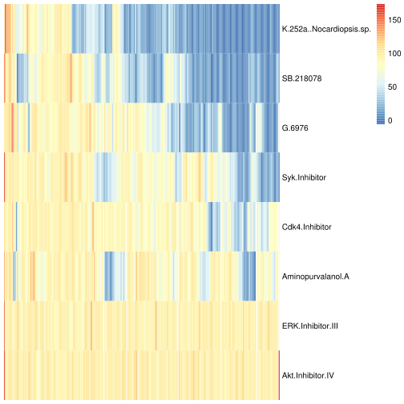
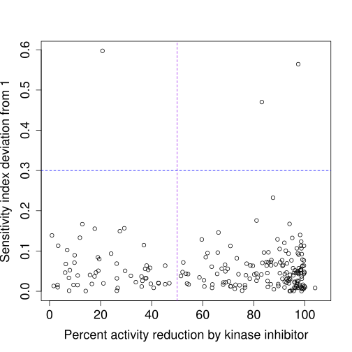

Produces Figure 1C, 1D
====


```r
require(reshape2)
```

```
## Loading required package: reshape2
```

```r
require(pheatmap)
```

```
## Loading required package: pheatmap
```

```r
#Change DATADIR to where you downloaded the supplement
DATADIR='/nfs/vendata/oursu/oana/GemPaper_2015-12-07'
```


```r
FIG_OUT=paste(DATADIR,'/results/data_processing/kinase/',sep='')
system(paste('mkdir',FIG_OUT))
KI_NAMES=paste(DATADIR,'/data/kinase/Table.S1.2.KI_names.txt',sep='')
KINASE_HITS=paste(DATADIR,'/results/data_processing/kinase/Table.S1.4.KinaseScreen_Hits.txt',sep='')
KINASE_TARGETS=paste(DATADIR,'/data/kinase/Table.S1.3.KinaseTargets.txt',sep='')
GENETIC_ANALYSIS=paste(DATADIR,'/data/genetic/Table.S2.1.GeneticHitsProcessedData.txt',sep='')
DE_FILE=paste(DATADIR,'/data/RNAseq/Table.S3.1.Cuffdiff_protein_coding_V23_vs_G23_gene_exp.diff',sep='')
FPKMmin=0.1
KINASE_THRESHOLD=50
KINASE_PHEN=paste(DATADIR,'/results/data_processing/kinase/KinaseTargets_for_phen_thresholdActivityReduction',KINASE_THRESHOLD,'.phen',sep='')
```

Read in files.


```r
#Kinase files
kinase.data=read.table(KINASE_TARGETS,header=TRUE,sep='\t')
kinase.data=kinase.data[-which(is.na(kinase.data$percent_activity)),]
dim(kinase.data)
```

```
## [1] 52834     4
```

```r
#Genetic hits files
genetic.data=read.table(GENETIC_ANALYSIS,header=TRUE)[,c('TraslatedGeneSymbol',
                                                         'ratio','FDR','controlStatus')]
#also read a table of expressed genes (for filtering)
de_data=read.table(DE_FILE,header=TRUE)
expressed_genes=de_data[union(which(de_data$value_1>=FPKMmin),which(de_data$value_2>=FPKMmin)),'gene']

#Convert kinase data to genetic names as well.
#Loop through kinase data and get corresponding genetic hit
kinase.data=data.frame(kinase.data,siRNAscreen.SI=NA)
unique_kinases=unique(kinase.data$target_kinase)
genetic.genes=as.character(genetic.data$TraslatedGeneSymbol)
for (kinase in unique_kinases){
  kinase_items=strsplit(kinase,'/')[[1]]
  correspondingGene=c()
  for (kinase_item in kinase_items){
    new_item=which(genetic.genes==kinase_item)
    if (length(new_item)>0){
      correspondingGene=c(correspondingGene,new_item) 
    }
  }
  if (length(correspondingGene)>0){
    kinase.data[which(as.character(kinase.data$target_kinase)==kinase),
                        'siRNAscreen.SI']=max(abs(1-as.numeric(as.character(genetic.data[correspondingGene,'ratio']))),na.rm=TRUE)
  }
}
```

Targets of gemcitabine synergizers.
----

Get the synergizer drugs.


```r
KI_dict=read.table(KI_NAMES,header=TRUE,sep='\t')
KI_dict[,'Ki_name']=gsub('/','.',gsub(' ','.',gsub(',','.',gsub('-','.',KI_dict[,'Ki_name']))))
rownames(KI_dict)=KI_dict[,'KI']
synergizer_ids=as.character(unique(read.table(KINASE_HITS,header=TRUE,sep='\t')[,'KI']))
synergizers=as.character(KI_dict[synergizer_ids,'Ki_name'])
synergy_rows=which(as.character(kinase.data$kinase_inhibitor) %in% synergizers)
print(synergizers) 
```

```
## [1] "SB.218078"                "Akt.Inhibitor.IV"        
## [3] "K.252a..Nocardiopsis.sp." "Aminopurvalanol.A"       
## [5] "G.6976"                   "Syk.Inhibitor"           
## [7] "ERK.Inhibitor.III"        "Cdk4.Inhibitor"
```

Make a heatmap of targets x synergizers. Note that for some pairs, data are missing. The data are missing from the original paper, it is not a bug in this code (http://www.nature.com/nbt/journal/v29/n11/full/nbt.2017.html)


```r
synergizer.data=kinase.data[synergy_rows,]
kinase.data[,1]=as.character(kinase.data[,1])
kinh.target.full=acast(kinase.data,
                  target_kinase~kinase_inhibitor,fun.aggregate=min,value.var='percent_activity',fill=1000)
kinh.target=acast(synergizer.data,
                  target_kinase~kinase_inhibitor,value.var='percent_activity')
get_optimal_ordering=function(m){
  require(cba)
  d <- dist(as.matrix(m))
  hc <- hclust(d)
  co <- order.optimal(d, hc$merge)
  m.optimalRows=as.matrix(m)[co$order,]
  d <- dist(as.matrix(t(m)))
  hc <- hclust(d)
  co <- order.optimal(d, hc$merge)
  m.optimal=m.optimalRows[,co$order]
  return(m.optimal)
}
pheatmap(get_optimal_ordering(t(kinh.target)),cluster_cols=FALSE,cluster_rows=FALSE,
         show_colnames=FALSE)
```

```
## Loading required package: cba
## Loading required package: grid
## Loading required package: proxy
## 
## Attaching package: 'proxy'
## 
## The following objects are masked from 'package:stats':
## 
##     as.dist, dist
## 
## The following object is masked from 'package:base':
## 
##     as.matrix
```

 

```r
#plot for the figure
pdf(paste(FIG_OUT,'KinaseHitHeatmap.pdf',sep=''),height=4,width=6)
pheatmap(get_optimal_ordering(t(kinh.target)),cluster_cols=FALSE,cluster_rows=FALSE,
         show_colnames=FALSE)
dev.off()
```

```
## pdf 
##   2
```

Now, make a histogram of targets per kinase inhibitor, for the whole data vs for the synergizer kinase inhibitors.


```r
activity_threshold=50
kinh.data.withBinary=kinase.data[which(as.numeric(as.character(kinase.data$percent_activity))<=activity_threshold),]
entries=unique(kinase.data[,1])
targets.perInh=rep(0,length(entries))
names(targets.perInh)=entries
targets.perInhCounts=table(kinh.data.withBinary[,'kinase_inhibitor'])
targets.perInh[names(targets.perInhCounts)]=targets.perInhCounts
pdf(paste(FIG_OUT,'InhibitorsPerKinase.pdf',sep=''))
par(mfrow=c(2,1))
hist(targets.perInh,breaks=100,xlim=c(0,250),xlab='Targets per inhibitor',main='Targets per kinase inhibitor \n (all)')
hist(targets.perInh[synergizers],breaks=100,xlab='Targets per inhibitor',xlim=c(0,250),main='Targets per inhibitor \n(gemcitabine synergizers)')
dev.off()
```

```
## pdf 
##   2
```

```r
expressed_kinase_hits2=c()
unique_kinaseHits2=unique(kinase.data[,'target_kinase'])
for (kinase in unique_kinaseHits2){
  kinase_items=strsplit(kinase,'/')[[1]]
  for (kinase_item in kinase_items){
    if (kinase_item %in% expressed_genes){
      expressed_kinase_hits2=c(expressed_kinase_hits2,kinase)
    }
  } 
}
kinh.data.withBinary=kinase.data[intersect(which(as.numeric(as.character(kinase.data$percent_activity))<=activity_threshold),which(kinase.data$target_kinase %in% expressed_kinase_hits2)),]
entries=unique(kinase.data[,1])
targets.perInh=rep(0,length(entries))
names(targets.perInh)=entries
targets.perInhCounts=table(kinh.data.withBinary[,'kinase_inhibitor'])
targets.perInh[names(targets.perInhCounts)]=targets.perInhCounts
pdf(paste(FIG_OUT,'InhibitorsPerKinase_expressed.pdf',sep=''),height=8,width=4)
par(mfrow=c(2,1))
hist(targets.perInh,breaks=100,xlim=c(0,160),xlab='Targets per inhibitor',main='Targets per kinase inhibitor \n (all)')
hist(targets.perInh[synergizers],breaks=100,xlab='Targets per inhibitor',xlim=c(0,160),main='Targets per inhibitor \n(gemcitabine synergizers)')
dev.off()
```

```
## pdf 
##   2
```

```r
pdf(paste(FIG_OUT,'InhibitorsPerKinase_expressedECDF.pdf',sep=''),height=4,width=4)
plot(ecdf(targets.perInh),main='ECDF Targets per kinase inhibitor\n Anastassiadis et al., 2011 ',xlab='Targets per kinase inhibitor',ylab='ECDF')
abline(v=2,col='blue')
dev.off()
```

```
## pdf 
##   2
```

Prepare a list of targets with associated values for the network input


```r
phendata=data.frame(target=character(),value=double())
for (target in rownames(kinh.target)){
  print(kinh.target[target,])
  val=min(kinh.target[target,],na.rm=TRUE)
  if (val<=KINASE_THRESHOLD){
    phendata=rbind(phendata,data.frame(target=gsub('/','_',target),value=100-val))
  }
} 
```

```
##         Akt.Inhibitor.IV        Aminopurvalanol.A           Cdk4.Inhibitor 
##                    96.73                    45.51                    83.27 
##        ERK.Inhibitor.III                   G.6976 K.252a..Nocardiopsis.sp. 
##                   101.43                    84.61                    92.87 
##                SB.218078            Syk.Inhibitor 
##                    72.66                    52.48 
##         Akt.Inhibitor.IV        Aminopurvalanol.A           Cdk4.Inhibitor 
##                    95.74                    21.32                    93.77 
##        ERK.Inhibitor.III                   G.6976 K.252a..Nocardiopsis.sp. 
##                    95.75                    42.28                    89.48 
##                SB.218078            Syk.Inhibitor 
##                    68.05                    54.24 
##         Akt.Inhibitor.IV        Aminopurvalanol.A           Cdk4.Inhibitor 
##                    98.00                    47.82                    97.36 
##        ERK.Inhibitor.III                   G.6976 K.252a..Nocardiopsis.sp. 
##                    99.88                     2.78                     1.05 
##                SB.218078            Syk.Inhibitor 
##                     2.39                    72.32 
##         Akt.Inhibitor.IV        Aminopurvalanol.A           Cdk4.Inhibitor 
##                   103.93                   116.75                   100.86 
##        ERK.Inhibitor.III                   G.6976 K.252a..Nocardiopsis.sp. 
##                    99.71                   108.19                    86.17 
##                SB.218078            Syk.Inhibitor 
##                    63.90                   104.79 
##         Akt.Inhibitor.IV        Aminopurvalanol.A           Cdk4.Inhibitor 
##                    99.63                   100.45                    86.91 
##        ERK.Inhibitor.III                   G.6976 K.252a..Nocardiopsis.sp. 
##                    99.68                   109.54                    84.20 
##                SB.218078            Syk.Inhibitor 
##                    48.52                    88.63 
##         Akt.Inhibitor.IV        Aminopurvalanol.A           Cdk4.Inhibitor 
##                   108.76                   101.15                    91.08 
##        ERK.Inhibitor.III                   G.6976 K.252a..Nocardiopsis.sp. 
##                    94.34                    85.29                    27.34 
##                SB.218078            Syk.Inhibitor 
##                    27.14                    97.40 
##         Akt.Inhibitor.IV        Aminopurvalanol.A           Cdk4.Inhibitor 
##                    99.14                    79.65                    93.96 
##        ERK.Inhibitor.III                   G.6976 K.252a..Nocardiopsis.sp. 
##                    93.65                    12.20                    10.71 
##                SB.218078            Syk.Inhibitor 
##                    36.91                    72.10 
##         Akt.Inhibitor.IV        Aminopurvalanol.A           Cdk4.Inhibitor 
##                   110.05                   108.78                   109.17 
##        ERK.Inhibitor.III                   G.6976 K.252a..Nocardiopsis.sp. 
##                   105.81                    73.64                    88.33 
##                SB.218078            Syk.Inhibitor 
##                    78.58                    99.11 
##         Akt.Inhibitor.IV        Aminopurvalanol.A           Cdk4.Inhibitor 
##                   102.58                    99.42                   127.36 
##        ERK.Inhibitor.III                   G.6976 K.252a..Nocardiopsis.sp. 
##                    97.98                   155.15                   119.66 
##                SB.218078            Syk.Inhibitor 
##                    85.82                   111.33 
##         Akt.Inhibitor.IV        Aminopurvalanol.A           Cdk4.Inhibitor 
##                   109.94                   106.52                   101.04 
##        ERK.Inhibitor.III                   G.6976 K.252a..Nocardiopsis.sp. 
##                   100.90                   115.42                   128.23 
##                SB.218078            Syk.Inhibitor 
##                   113.16                    98.38 
##         Akt.Inhibitor.IV        Aminopurvalanol.A           Cdk4.Inhibitor 
##                   101.90                   102.84                    96.87 
##        ERK.Inhibitor.III                   G.6976 K.252a..Nocardiopsis.sp. 
##                    96.62                   103.73                   115.77 
##                SB.218078            Syk.Inhibitor 
##                   110.47                    97.78 
##         Akt.Inhibitor.IV        Aminopurvalanol.A           Cdk4.Inhibitor 
##                   101.51                    82.39                    99.84 
##        ERK.Inhibitor.III                   G.6976 K.252a..Nocardiopsis.sp. 
##                    92.68                   102.81                   165.29 
##                SB.218078            Syk.Inhibitor 
##                   126.66                   112.89 
##         Akt.Inhibitor.IV        Aminopurvalanol.A           Cdk4.Inhibitor 
##                    96.14                    61.55                    14.26 
##        ERK.Inhibitor.III                   G.6976 K.252a..Nocardiopsis.sp. 
##                    96.39                     3.86                     1.05 
##                SB.218078            Syk.Inhibitor 
##                     2.09                     5.88 
##         Akt.Inhibitor.IV        Aminopurvalanol.A           Cdk4.Inhibitor 
##                   100.31                    95.58                    94.93 
##        ERK.Inhibitor.III                   G.6976 K.252a..Nocardiopsis.sp. 
##                    92.46                    49.79                     3.55 
##                SB.218078            Syk.Inhibitor 
##                    56.20                    53.23 
##         Akt.Inhibitor.IV        Aminopurvalanol.A           Cdk4.Inhibitor 
##                    88.10                    80.45                    60.68 
##        ERK.Inhibitor.III                   G.6976 K.252a..Nocardiopsis.sp. 
##                   105.16                    56.80                     4.62 
##                SB.218078            Syk.Inhibitor 
##                    22.28                    20.01 
##         Akt.Inhibitor.IV        Aminopurvalanol.A           Cdk4.Inhibitor 
##                    93.85                    87.79                    44.25 
##        ERK.Inhibitor.III                   G.6976 K.252a..Nocardiopsis.sp. 
##                    99.07                    33.13                     3.51 
##                SB.218078            Syk.Inhibitor 
##                     9.52                    10.49 
##         Akt.Inhibitor.IV        Aminopurvalanol.A           Cdk4.Inhibitor 
##                    91.30                    91.90                    51.90 
##        ERK.Inhibitor.III                   G.6976 K.252a..Nocardiopsis.sp. 
##                    90.54                    55.73                     7.25 
##                SB.218078            Syk.Inhibitor 
##                    36.48                    37.14 
##         Akt.Inhibitor.IV        Aminopurvalanol.A           Cdk4.Inhibitor 
##                   101.37                    93.08                    82.92 
##        ERK.Inhibitor.III                   G.6976 K.252a..Nocardiopsis.sp. 
##                   100.02                   101.62                    40.97 
##                SB.218078            Syk.Inhibitor 
##                    38.13                    49.19 
##         Akt.Inhibitor.IV        Aminopurvalanol.A           Cdk4.Inhibitor 
##                    99.14                    79.65                    83.91 
##        ERK.Inhibitor.III                   G.6976 K.252a..Nocardiopsis.sp. 
##                   101.83                    68.07                    27.42 
##                SB.218078            Syk.Inhibitor 
##                    37.68                    42.85 
##         Akt.Inhibitor.IV        Aminopurvalanol.A           Cdk4.Inhibitor 
##                   108.30                    81.89                    92.01 
##        ERK.Inhibitor.III                   G.6976 K.252a..Nocardiopsis.sp. 
##                    90.13                    13.71                     7.88 
##                SB.218078            Syk.Inhibitor 
##                    27.48                    77.03 
##         Akt.Inhibitor.IV        Aminopurvalanol.A           Cdk4.Inhibitor 
##                   100.37                    97.45                    98.93 
##        ERK.Inhibitor.III                   G.6976 K.252a..Nocardiopsis.sp. 
##                    98.35                   110.04                   133.42 
##                SB.218078            Syk.Inhibitor 
##                   105.05                    96.81 
##         Akt.Inhibitor.IV        Aminopurvalanol.A           Cdk4.Inhibitor 
##                    90.24                    85.60                    92.69 
##        ERK.Inhibitor.III                   G.6976 K.252a..Nocardiopsis.sp. 
##                   101.24                    38.69                    23.20 
##                SB.218078            Syk.Inhibitor 
##                    83.92                    80.16 
##         Akt.Inhibitor.IV        Aminopurvalanol.A           Cdk4.Inhibitor 
##                   101.22                    93.13                    21.48 
##        ERK.Inhibitor.III                   G.6976 K.252a..Nocardiopsis.sp. 
##                    97.25                    20.17                     1.56 
##                SB.218078            Syk.Inhibitor 
##                    14.81                    47.82 
##         Akt.Inhibitor.IV        Aminopurvalanol.A           Cdk4.Inhibitor 
##                    95.74                    88.25                    35.59 
##        ERK.Inhibitor.III                   G.6976 K.252a..Nocardiopsis.sp. 
##                   105.59                    26.30                     9.80 
##                SB.218078            Syk.Inhibitor 
##                    13.56                    65.52 
##         Akt.Inhibitor.IV        Aminopurvalanol.A           Cdk4.Inhibitor 
##                    91.59                    33.03                    74.81 
##        ERK.Inhibitor.III                   G.6976 K.252a..Nocardiopsis.sp. 
##                   109.57                    22.02                     8.92 
##                SB.218078            Syk.Inhibitor 
##                    43.26                    30.40 
##         Akt.Inhibitor.IV        Aminopurvalanol.A           Cdk4.Inhibitor 
##                    94.41                    95.31                    99.04 
##        ERK.Inhibitor.III                   G.6976 K.252a..Nocardiopsis.sp. 
##                   106.01                    94.20                    26.46 
##                SB.218078            Syk.Inhibitor 
##                    69.74                    75.73 
##         Akt.Inhibitor.IV        Aminopurvalanol.A           Cdk4.Inhibitor 
##                   113.63                   131.66                    99.44 
##        ERK.Inhibitor.III                   G.6976 K.252a..Nocardiopsis.sp. 
##                   100.49                   103.11                    55.67 
##                SB.218078            Syk.Inhibitor 
##                    50.49                    58.14 
##         Akt.Inhibitor.IV        Aminopurvalanol.A           Cdk4.Inhibitor 
##                    99.70                   103.16                    92.24 
##        ERK.Inhibitor.III                   G.6976 K.252a..Nocardiopsis.sp. 
##                    96.43                    82.41                    24.38 
##                SB.218078            Syk.Inhibitor 
##                    33.57                    69.56 
##         Akt.Inhibitor.IV        Aminopurvalanol.A           Cdk4.Inhibitor 
##                   101.33                   104.67                    94.51 
##        ERK.Inhibitor.III                   G.6976 K.252a..Nocardiopsis.sp. 
##                   103.53                   100.61                    42.54 
##                SB.218078            Syk.Inhibitor 
##                    56.53                    89.25 
##         Akt.Inhibitor.IV        Aminopurvalanol.A           Cdk4.Inhibitor 
##                   103.20                    83.93                    78.33 
##        ERK.Inhibitor.III                   G.6976 K.252a..Nocardiopsis.sp. 
##                   100.07                    19.08                     0.84 
##                SB.218078            Syk.Inhibitor 
##                     2.84                    57.61 
##         Akt.Inhibitor.IV        Aminopurvalanol.A           Cdk4.Inhibitor 
##                   102.95                    98.18                    80.30 
##        ERK.Inhibitor.III                   G.6976 K.252a..Nocardiopsis.sp. 
##                   100.12                    51.25                     4.81 
##                SB.218078            Syk.Inhibitor 
##                     9.85                    86.45 
##         Akt.Inhibitor.IV        Aminopurvalanol.A           Cdk4.Inhibitor 
##                    94.02                    87.31                    63.05 
##        ERK.Inhibitor.III                   G.6976 K.252a..Nocardiopsis.sp. 
##                    90.08                    20.30                     2.59 
##                SB.218078            Syk.Inhibitor 
##                     7.03                    66.81 
##         Akt.Inhibitor.IV        Aminopurvalanol.A           Cdk4.Inhibitor 
##                   102.92                   104.49                    99.48 
##        ERK.Inhibitor.III                   G.6976 K.252a..Nocardiopsis.sp. 
##                    82.15                    21.88                     3.10 
##                SB.218078            Syk.Inhibitor 
##                     8.36                    91.93 
##         Akt.Inhibitor.IV        Aminopurvalanol.A           Cdk4.Inhibitor 
##                    93.21                    97.43                    96.24 
##        ERK.Inhibitor.III                   G.6976 K.252a..Nocardiopsis.sp. 
##                    95.21                    88.10                   100.35 
##                SB.218078            Syk.Inhibitor 
##                    98.71                    96.40 
##         Akt.Inhibitor.IV        Aminopurvalanol.A           Cdk4.Inhibitor 
##                   114.69                    86.84                    99.09 
##        ERK.Inhibitor.III                   G.6976 K.252a..Nocardiopsis.sp. 
##                   106.25                    19.25                    19.01 
##                SB.218078            Syk.Inhibitor 
##                    27.21                    44.91 
##         Akt.Inhibitor.IV        Aminopurvalanol.A           Cdk4.Inhibitor 
##                   115.19                    33.25                    48.12 
##        ERK.Inhibitor.III                   G.6976 K.252a..Nocardiopsis.sp. 
##                   113.56                     3.88                     6.56 
##                SB.218078            Syk.Inhibitor 
##                     7.93                    34.37 
##         Akt.Inhibitor.IV        Aminopurvalanol.A           Cdk4.Inhibitor 
##                    98.78                    25.85                    91.89 
##        ERK.Inhibitor.III                   G.6976 K.252a..Nocardiopsis.sp. 
##                   100.37                    55.54                    19.80 
##                SB.218078            Syk.Inhibitor 
##                    61.65                    56.92 
##         Akt.Inhibitor.IV        Aminopurvalanol.A           Cdk4.Inhibitor 
##                   105.13                    17.04                    47.81 
##        ERK.Inhibitor.III                   G.6976 K.252a..Nocardiopsis.sp. 
##                    87.94                    38.69                    18.66 
##                SB.218078            Syk.Inhibitor 
##                    29.86                    49.61 
##         Akt.Inhibitor.IV        Aminopurvalanol.A           Cdk4.Inhibitor 
##                   100.42                     4.07                    52.50 
##        ERK.Inhibitor.III                   G.6976 K.252a..Nocardiopsis.sp. 
##                   105.63                    20.84                     4.20 
##                SB.218078            Syk.Inhibitor 
##                    15.64                    66.21 
##         Akt.Inhibitor.IV        Aminopurvalanol.A           Cdk4.Inhibitor 
##                    92.88                     7.97                    74.87 
##        ERK.Inhibitor.III                   G.6976 K.252a..Nocardiopsis.sp. 
##                   104.61                    27.82                    17.20 
##                SB.218078            Syk.Inhibitor 
##                    28.55                    77.93 
##         Akt.Inhibitor.IV        Aminopurvalanol.A           Cdk4.Inhibitor 
##                    92.17                    31.91                    88.09 
##        ERK.Inhibitor.III                   G.6976 K.252a..Nocardiopsis.sp. 
##                    84.95                    65.20                    47.47 
##                SB.218078            Syk.Inhibitor 
##                    71.48                    90.32 
##         Akt.Inhibitor.IV        Aminopurvalanol.A           Cdk4.Inhibitor 
##                   107.34                    71.96                    84.91 
##        ERK.Inhibitor.III                   G.6976 K.252a..Nocardiopsis.sp. 
##                    96.62                    27.54                     2.90 
##                SB.218078            Syk.Inhibitor 
##                    11.18                   105.53 
##         Akt.Inhibitor.IV        Aminopurvalanol.A           Cdk4.Inhibitor 
##                   102.43                    76.51                    21.06 
##        ERK.Inhibitor.III                   G.6976 K.252a..Nocardiopsis.sp. 
##                   103.36                    44.55                     3.35 
##                SB.218078            Syk.Inhibitor 
##                    22.23                    94.00 
##         Akt.Inhibitor.IV        Aminopurvalanol.A           Cdk4.Inhibitor 
##                   102.69                     3.31                    43.44 
##        ERK.Inhibitor.III                   G.6976 K.252a..Nocardiopsis.sp. 
##                    96.54                    21.27                     8.20 
##                SB.218078            Syk.Inhibitor 
##                    27.97                    57.96 
##         Akt.Inhibitor.IV        Aminopurvalanol.A           Cdk4.Inhibitor 
##                    97.61                     0.13                    44.14 
##        ERK.Inhibitor.III                   G.6976 K.252a..Nocardiopsis.sp. 
##                    89.21                     8.52                     6.63 
##                SB.218078            Syk.Inhibitor 
##                    23.32                    55.80 
##         Akt.Inhibitor.IV        Aminopurvalanol.A           Cdk4.Inhibitor 
##                   102.76                    56.42                    12.17 
##        ERK.Inhibitor.III                   G.6976 K.252a..Nocardiopsis.sp. 
##                   100.41                    39.36                     5.76 
##                SB.218078            Syk.Inhibitor 
##                     6.06                    82.44 
##         Akt.Inhibitor.IV        Aminopurvalanol.A           Cdk4.Inhibitor 
##                    92.18                    51.08                    40.18 
##        ERK.Inhibitor.III                   G.6976 K.252a..Nocardiopsis.sp. 
##                    94.69                    52.08                     7.18 
##                SB.218078            Syk.Inhibitor 
##                    19.91                    81.39 
##         Akt.Inhibitor.IV        Aminopurvalanol.A           Cdk4.Inhibitor 
##                    97.78                    54.70                    93.06 
##        ERK.Inhibitor.III                   G.6976 K.252a..Nocardiopsis.sp. 
##                   100.07                    84.55                    77.76 
##                SB.218078            Syk.Inhibitor 
##                    80.40                    73.65 
##         Akt.Inhibitor.IV        Aminopurvalanol.A           Cdk4.Inhibitor 
##                   105.74                    65.68                    82.66 
##        ERK.Inhibitor.III                   G.6976 K.252a..Nocardiopsis.sp. 
##                    95.69                    55.18                    25.42 
##                SB.218078            Syk.Inhibitor 
##                    15.76                    86.85 
##         Akt.Inhibitor.IV        Aminopurvalanol.A           Cdk4.Inhibitor 
##                    89.55                    67.60                    87.52 
##        ERK.Inhibitor.III                   G.6976 K.252a..Nocardiopsis.sp. 
##                   108.78                    46.76                    26.37 
##                SB.218078            Syk.Inhibitor 
##                     8.52                    65.02 
##         Akt.Inhibitor.IV        Aminopurvalanol.A           Cdk4.Inhibitor 
##                   103.10                    96.19                    79.73 
##        ERK.Inhibitor.III                   G.6976 K.252a..Nocardiopsis.sp. 
##                   106.80                     7.95                     2.60 
##                SB.218078            Syk.Inhibitor 
##                     3.63                    19.48 
##         Akt.Inhibitor.IV        Aminopurvalanol.A           Cdk4.Inhibitor 
##                   105.36                    96.28                    37.50 
##        ERK.Inhibitor.III                   G.6976 K.252a..Nocardiopsis.sp. 
##                   103.66                    50.20                     2.87 
##                SB.218078            Syk.Inhibitor 
##                    13.00                     1.30 
##         Akt.Inhibitor.IV        Aminopurvalanol.A           Cdk4.Inhibitor 
##                   105.93                    75.51                    95.40 
##        ERK.Inhibitor.III                   G.6976 K.252a..Nocardiopsis.sp. 
##                   112.74                    75.45                    93.67 
##                SB.218078            Syk.Inhibitor 
##                   103.60                   105.43 
##         Akt.Inhibitor.IV        Aminopurvalanol.A           Cdk4.Inhibitor 
##                   103.82                    65.73                    96.87 
##        ERK.Inhibitor.III                   G.6976 K.252a..Nocardiopsis.sp. 
##                    99.85                    97.55                   100.15 
##                SB.218078            Syk.Inhibitor 
##                    93.77                   102.34 
##         Akt.Inhibitor.IV        Aminopurvalanol.A           Cdk4.Inhibitor 
##                   104.54                    82.72                    82.22 
##        ERK.Inhibitor.III                   G.6976 K.252a..Nocardiopsis.sp. 
##                    91.03                    80.41                   102.31 
##                SB.218078            Syk.Inhibitor 
##                    47.33                    89.02 
##         Akt.Inhibitor.IV        Aminopurvalanol.A           Cdk4.Inhibitor 
##                   104.02                    26.43                    96.20 
##        ERK.Inhibitor.III                   G.6976 K.252a..Nocardiopsis.sp. 
##                    96.41                    93.31                   100.75 
##                SB.218078            Syk.Inhibitor 
##                    96.10                    88.32 
##         Akt.Inhibitor.IV        Aminopurvalanol.A           Cdk4.Inhibitor 
##                   100.65                    35.19                    89.53 
##        ERK.Inhibitor.III                   G.6976 K.252a..Nocardiopsis.sp. 
##                   101.02                   105.11                    98.72 
##                SB.218078            Syk.Inhibitor 
##                    81.83                   100.25 
##         Akt.Inhibitor.IV        Aminopurvalanol.A           Cdk4.Inhibitor 
##                    92.36                    13.40                    94.64 
##        ERK.Inhibitor.III                   G.6976 K.252a..Nocardiopsis.sp. 
##                    86.18                   136.91                    93.74 
##                SB.218078            Syk.Inhibitor 
##                   107.87                   109.35 
##         Akt.Inhibitor.IV        Aminopurvalanol.A           Cdk4.Inhibitor 
##                    96.82                    99.27                    93.13 
##        ERK.Inhibitor.III                   G.6976 K.252a..Nocardiopsis.sp. 
##                    91.01                    73.13                    82.03 
##                SB.218078            Syk.Inhibitor 
##                    16.74                    84.66 
##         Akt.Inhibitor.IV        Aminopurvalanol.A           Cdk4.Inhibitor 
##                   104.90                   105.74                    93.19 
##        ERK.Inhibitor.III                   G.6976 K.252a..Nocardiopsis.sp. 
##                   106.53                   103.67                       NA 
##                SB.218078            Syk.Inhibitor 
##                     4.47                    66.04 
##         Akt.Inhibitor.IV        Aminopurvalanol.A           Cdk4.Inhibitor 
##                   104.39                    86.15                   127.84 
##        ERK.Inhibitor.III                   G.6976 K.252a..Nocardiopsis.sp. 
##                    96.40                    96.94                    57.34 
##                SB.218078            Syk.Inhibitor 
##                    60.84                    68.24 
##         Akt.Inhibitor.IV        Aminopurvalanol.A           Cdk4.Inhibitor 
##                   107.87                    51.91                    96.99 
##        ERK.Inhibitor.III                   G.6976 K.252a..Nocardiopsis.sp. 
##                   104.65                    69.89                     1.45 
##                SB.218078            Syk.Inhibitor 
##                    43.08                    88.26 
##         Akt.Inhibitor.IV        Aminopurvalanol.A           Cdk4.Inhibitor 
##                    98.38                    17.65                    84.75 
##        ERK.Inhibitor.III                   G.6976 K.252a..Nocardiopsis.sp. 
##                    88.31                    88.74                     4.38 
##                SB.218078            Syk.Inhibitor 
##                    52.12                    38.13 
##         Akt.Inhibitor.IV        Aminopurvalanol.A           Cdk4.Inhibitor 
##                   113.59                    85.46                    93.37 
##        ERK.Inhibitor.III                   G.6976 K.252a..Nocardiopsis.sp. 
##                    97.70                    23.08                    97.95 
##                SB.218078            Syk.Inhibitor 
##                    97.02                    81.39 
##         Akt.Inhibitor.IV        Aminopurvalanol.A           Cdk4.Inhibitor 
##                    95.46                    16.49                    49.51 
##        ERK.Inhibitor.III                   G.6976 K.252a..Nocardiopsis.sp. 
##                   102.63                    66.18                    10.37 
##                SB.218078            Syk.Inhibitor 
##                    20.32                    42.57 
##         Akt.Inhibitor.IV        Aminopurvalanol.A           Cdk4.Inhibitor 
##                    96.54                    79.70                    69.09 
##        ERK.Inhibitor.III                   G.6976 K.252a..Nocardiopsis.sp. 
##                    92.25                    59.92                     3.58 
##                SB.218078            Syk.Inhibitor 
##                    13.63                    45.93 
##         Akt.Inhibitor.IV        Aminopurvalanol.A           Cdk4.Inhibitor 
##                   108.20                   109.40                    76.57 
##        ERK.Inhibitor.III                   G.6976 K.252a..Nocardiopsis.sp. 
##                    96.28                   100.43                    53.19 
##                SB.218078            Syk.Inhibitor 
##                    76.89                    84.18 
##         Akt.Inhibitor.IV        Aminopurvalanol.A           Cdk4.Inhibitor 
##                    91.99                   109.19                    88.97 
##        ERK.Inhibitor.III                   G.6976 K.252a..Nocardiopsis.sp. 
##                    98.85                   111.46                   134.52 
##                SB.218078            Syk.Inhibitor 
##                    94.63                    96.81 
##         Akt.Inhibitor.IV        Aminopurvalanol.A           Cdk4.Inhibitor 
##                   100.43                    79.28                   100.04 
##        ERK.Inhibitor.III                   G.6976 K.252a..Nocardiopsis.sp. 
##                    98.53                    80.97                    31.12 
##                SB.218078            Syk.Inhibitor 
##                    79.70                    89.29 
##         Akt.Inhibitor.IV        Aminopurvalanol.A           Cdk4.Inhibitor 
##                    94.53                     3.75                    88.94 
##        ERK.Inhibitor.III                   G.6976 K.252a..Nocardiopsis.sp. 
##                    99.01                    74.83                    29.96 
##                SB.218078            Syk.Inhibitor 
##                    69.51                    45.06 
##         Akt.Inhibitor.IV        Aminopurvalanol.A           Cdk4.Inhibitor 
##                    96.41                   111.14                    97.33 
##        ERK.Inhibitor.III                   G.6976 K.252a..Nocardiopsis.sp. 
##                    94.26                   100.38                   138.41 
##                SB.218078            Syk.Inhibitor 
##                    91.75                   103.08 
##         Akt.Inhibitor.IV        Aminopurvalanol.A           Cdk4.Inhibitor 
##                    74.70                    95.33                    73.52 
##        ERK.Inhibitor.III                   G.6976 K.252a..Nocardiopsis.sp. 
##                    97.83                   101.69                    29.00 
##                SB.218078            Syk.Inhibitor 
##                    32.66                    98.85 
##         Akt.Inhibitor.IV        Aminopurvalanol.A           Cdk4.Inhibitor 
##                    94.31                   100.74                    98.38 
##        ERK.Inhibitor.III                   G.6976 K.252a..Nocardiopsis.sp. 
##                    80.14                    84.36                    59.23 
##                SB.218078            Syk.Inhibitor 
##                    39.35                    94.00 
##         Akt.Inhibitor.IV        Aminopurvalanol.A           Cdk4.Inhibitor 
##                   101.77                   104.59                    87.19 
##        ERK.Inhibitor.III                   G.6976 K.252a..Nocardiopsis.sp. 
##                   100.93                    84.72                    74.43 
##                SB.218078            Syk.Inhibitor 
##                    89.62                    93.19 
##         Akt.Inhibitor.IV        Aminopurvalanol.A           Cdk4.Inhibitor 
##                    97.35                   127.93                    91.77 
##        ERK.Inhibitor.III                   G.6976 K.252a..Nocardiopsis.sp. 
##                   101.37                    73.31                    79.98 
##                SB.218078            Syk.Inhibitor 
##                    80.13                   100.33 
##         Akt.Inhibitor.IV        Aminopurvalanol.A           Cdk4.Inhibitor 
##                    93.88                    99.74                   103.97 
##        ERK.Inhibitor.III                   G.6976 K.252a..Nocardiopsis.sp. 
##                   101.89                   100.61                   102.84 
##                SB.218078            Syk.Inhibitor 
##                    98.85                   106.10 
##         Akt.Inhibitor.IV        Aminopurvalanol.A           Cdk4.Inhibitor 
##                    96.94                    96.30                    29.52 
##        ERK.Inhibitor.III                   G.6976 K.252a..Nocardiopsis.sp. 
##                   100.19                    85.31                     4.07 
##                SB.218078            Syk.Inhibitor 
##                     8.65                    57.49 
##         Akt.Inhibitor.IV        Aminopurvalanol.A           Cdk4.Inhibitor 
##                   100.81                    38.27                    82.80 
##        ERK.Inhibitor.III                   G.6976 K.252a..Nocardiopsis.sp. 
##                   103.61                    25.55                     3.88 
##                SB.218078            Syk.Inhibitor 
##                     3.15                   103.74 
##         Akt.Inhibitor.IV        Aminopurvalanol.A           Cdk4.Inhibitor 
##                    96.68                    57.10                    84.05 
##        ERK.Inhibitor.III                   G.6976 K.252a..Nocardiopsis.sp. 
##                    95.83                    46.27                    11.67 
##                SB.218078            Syk.Inhibitor 
##                     8.74                    92.17 
##         Akt.Inhibitor.IV        Aminopurvalanol.A           Cdk4.Inhibitor 
##                   105.46                    93.22                    70.51 
##        ERK.Inhibitor.III                   G.6976 K.252a..Nocardiopsis.sp. 
##                    93.08                    48.94                     9.90 
##                SB.218078            Syk.Inhibitor 
##                     5.94                    85.48 
##         Akt.Inhibitor.IV        Aminopurvalanol.A           Cdk4.Inhibitor 
##                    98.69                   103.33                    94.53 
##        ERK.Inhibitor.III                   G.6976 K.252a..Nocardiopsis.sp. 
##                   101.52                    83.92                    10.44 
##                SB.218078            Syk.Inhibitor 
##                    16.58                    89.71 
##         Akt.Inhibitor.IV        Aminopurvalanol.A           Cdk4.Inhibitor 
##                   106.80                    91.62                    85.99 
##        ERK.Inhibitor.III                   G.6976 K.252a..Nocardiopsis.sp. 
##                    92.69                    95.65                    96.34 
##                SB.218078            Syk.Inhibitor 
##                    87.77                    73.69 
##         Akt.Inhibitor.IV        Aminopurvalanol.A           Cdk4.Inhibitor 
##                   103.00                    93.90                   100.49 
##        ERK.Inhibitor.III                   G.6976 K.252a..Nocardiopsis.sp. 
##                   100.21                    63.62                    86.59 
##                SB.218078            Syk.Inhibitor 
##                    78.34                    77.54 
##         Akt.Inhibitor.IV        Aminopurvalanol.A           Cdk4.Inhibitor 
##                    77.14                    76.89                    98.10 
##        ERK.Inhibitor.III                   G.6976 K.252a..Nocardiopsis.sp. 
##                    88.87                    81.58                    62.56 
##                SB.218078            Syk.Inhibitor 
##                    90.12                   100.61 
##         Akt.Inhibitor.IV        Aminopurvalanol.A           Cdk4.Inhibitor 
##                   100.36                    67.54                    99.18 
##        ERK.Inhibitor.III                   G.6976 K.252a..Nocardiopsis.sp. 
##                   106.82                    92.48                    63.04 
##                SB.218078            Syk.Inhibitor 
##                    91.26                    93.02 
##         Akt.Inhibitor.IV        Aminopurvalanol.A           Cdk4.Inhibitor 
##                    99.45                    86.64                   100.05 
##        ERK.Inhibitor.III                   G.6976 K.252a..Nocardiopsis.sp. 
##                    99.27                    97.87                    81.29 
##                SB.218078            Syk.Inhibitor 
##                    96.53                    80.89 
##         Akt.Inhibitor.IV        Aminopurvalanol.A           Cdk4.Inhibitor 
##                    91.90                    61.35                    91.29 
##        ERK.Inhibitor.III                   G.6976 K.252a..Nocardiopsis.sp. 
##                   103.82                    90.42                    70.37 
##                SB.218078            Syk.Inhibitor 
##                    91.44                    80.47 
##         Akt.Inhibitor.IV        Aminopurvalanol.A           Cdk4.Inhibitor 
##                    99.96                    63.98                    90.55 
##        ERK.Inhibitor.III                   G.6976 K.252a..Nocardiopsis.sp. 
##                   100.46                    88.21                    70.01 
##                SB.218078            Syk.Inhibitor 
##                    78.68                    69.28 
##         Akt.Inhibitor.IV        Aminopurvalanol.A           Cdk4.Inhibitor 
##                       NA                       NA                       NA 
##        ERK.Inhibitor.III                   G.6976 K.252a..Nocardiopsis.sp. 
##                       NA                       NA                    59.51 
##                SB.218078            Syk.Inhibitor 
##                    63.93                    30.22 
##         Akt.Inhibitor.IV        Aminopurvalanol.A           Cdk4.Inhibitor 
##                    97.91                    80.20                    95.33 
##        ERK.Inhibitor.III                   G.6976 K.252a..Nocardiopsis.sp. 
##                    97.85                    62.58                    41.29 
##                SB.218078            Syk.Inhibitor 
##                    69.21                    41.29 
##         Akt.Inhibitor.IV        Aminopurvalanol.A           Cdk4.Inhibitor 
##                    96.31                    92.50                   101.92 
##        ERK.Inhibitor.III                   G.6976 K.252a..Nocardiopsis.sp. 
##                   101.91                    91.71                    96.28 
##                SB.218078            Syk.Inhibitor 
##                    89.87                    83.43 
##         Akt.Inhibitor.IV        Aminopurvalanol.A           Cdk4.Inhibitor 
##                   103.57                    59.19                    95.46 
##        ERK.Inhibitor.III                   G.6976 K.252a..Nocardiopsis.sp. 
##                   106.80                    94.96                    60.85 
##                SB.218078            Syk.Inhibitor 
##                    80.21                    68.72 
##         Akt.Inhibitor.IV        Aminopurvalanol.A           Cdk4.Inhibitor 
##                    99.13                    73.62                    99.47 
##        ERK.Inhibitor.III                   G.6976 K.252a..Nocardiopsis.sp. 
##                    84.58                    77.74                    87.54 
##                SB.218078            Syk.Inhibitor 
##                    98.38                    84.81 
##         Akt.Inhibitor.IV        Aminopurvalanol.A           Cdk4.Inhibitor 
##                   101.54                    95.33                    91.92 
##        ERK.Inhibitor.III                   G.6976 K.252a..Nocardiopsis.sp. 
##                    91.72                    87.16                    92.99 
##                SB.218078            Syk.Inhibitor 
##                    93.23                    93.24 
##         Akt.Inhibitor.IV        Aminopurvalanol.A           Cdk4.Inhibitor 
##                   102.71                    58.39                    86.53 
##        ERK.Inhibitor.III                   G.6976 K.252a..Nocardiopsis.sp. 
##                    91.60                    96.33                    82.52 
##                SB.218078            Syk.Inhibitor 
##                    75.42                    57.36 
##         Akt.Inhibitor.IV        Aminopurvalanol.A           Cdk4.Inhibitor 
##                    92.03                    92.91                   100.59 
##        ERK.Inhibitor.III                   G.6976 K.252a..Nocardiopsis.sp. 
##                   100.06                   106.91                    94.89 
##                SB.218078            Syk.Inhibitor 
##                    98.38                   120.19 
##         Akt.Inhibitor.IV        Aminopurvalanol.A           Cdk4.Inhibitor 
##                   101.63                   131.04                   100.51 
##        ERK.Inhibitor.III                   G.6976 K.252a..Nocardiopsis.sp. 
##                   102.63                   100.39                    84.94 
##                SB.218078            Syk.Inhibitor 
##                    72.46                    81.29 
##         Akt.Inhibitor.IV        Aminopurvalanol.A           Cdk4.Inhibitor 
##                   112.10                   105.90                   108.45 
##        ERK.Inhibitor.III                   G.6976 K.252a..Nocardiopsis.sp. 
##                    88.38                    72.55                    24.37 
##                SB.218078            Syk.Inhibitor 
##                   102.37                   109.08 
##         Akt.Inhibitor.IV        Aminopurvalanol.A           Cdk4.Inhibitor 
##                   112.42                    95.41                    92.42 
##        ERK.Inhibitor.III                   G.6976 K.252a..Nocardiopsis.sp. 
##                    99.73                   104.09                    47.96 
##                SB.218078            Syk.Inhibitor 
##                    88.68                    98.19 
##         Akt.Inhibitor.IV        Aminopurvalanol.A           Cdk4.Inhibitor 
##                   108.20                    59.53                    91.77 
##        ERK.Inhibitor.III                   G.6976 K.252a..Nocardiopsis.sp. 
##                   107.27                    77.03                    67.28 
##                SB.218078            Syk.Inhibitor 
##                    23.48                    94.09 
##         Akt.Inhibitor.IV        Aminopurvalanol.A           Cdk4.Inhibitor 
##                    98.89                    54.90                    88.94 
##        ERK.Inhibitor.III                   G.6976 K.252a..Nocardiopsis.sp. 
##                    94.67                     5.90                     1.83 
##                SB.218078            Syk.Inhibitor 
##                     5.39                    20.01 
##         Akt.Inhibitor.IV        Aminopurvalanol.A           Cdk4.Inhibitor 
##                   101.48                    69.19                    88.12 
##        ERK.Inhibitor.III                   G.6976 K.252a..Nocardiopsis.sp. 
##                   101.24                    78.41                    36.35 
##                SB.218078            Syk.Inhibitor 
##                    42.08                    57.40 
##         Akt.Inhibitor.IV        Aminopurvalanol.A           Cdk4.Inhibitor 
##                    97.42                    76.66                    85.27 
##        ERK.Inhibitor.III                   G.6976 K.252a..Nocardiopsis.sp. 
##                    97.63                    63.31                    43.72 
##                SB.218078            Syk.Inhibitor 
##                    29.13                    50.16 
##         Akt.Inhibitor.IV        Aminopurvalanol.A           Cdk4.Inhibitor 
##                   100.31                    97.27                    98.39 
##        ERK.Inhibitor.III                   G.6976 K.252a..Nocardiopsis.sp. 
##                   103.60                    79.84                    45.41 
##                SB.218078            Syk.Inhibitor 
##                    34.11                    50.53 
##         Akt.Inhibitor.IV        Aminopurvalanol.A           Cdk4.Inhibitor 
##                    88.38                    79.40                    86.20 
##        ERK.Inhibitor.III                   G.6976 K.252a..Nocardiopsis.sp. 
##                    99.63                    76.72                    46.66 
##                SB.218078            Syk.Inhibitor 
##                    36.32                    33.83 
##         Akt.Inhibitor.IV        Aminopurvalanol.A           Cdk4.Inhibitor 
##                    84.11                    93.39                    90.58 
##        ERK.Inhibitor.III                   G.6976 K.252a..Nocardiopsis.sp. 
##                   105.83                    86.49                    82.94 
##                SB.218078            Syk.Inhibitor 
##                    70.40                    74.10 
##         Akt.Inhibitor.IV        Aminopurvalanol.A           Cdk4.Inhibitor 
##                    94.05                    15.02                    88.77 
##        ERK.Inhibitor.III                   G.6976 K.252a..Nocardiopsis.sp. 
##                    90.87                    70.72                    12.13 
##                SB.218078            Syk.Inhibitor 
##                    30.86                    28.37 
##         Akt.Inhibitor.IV        Aminopurvalanol.A           Cdk4.Inhibitor 
##                    94.09                    97.54                    56.53 
##        ERK.Inhibitor.III                   G.6976 K.252a..Nocardiopsis.sp. 
##                    97.62                    63.61                    23.20 
##                SB.218078            Syk.Inhibitor 
##                    13.31                    70.14 
##         Akt.Inhibitor.IV        Aminopurvalanol.A           Cdk4.Inhibitor 
##                    98.60                     8.35                     8.19 
##        ERK.Inhibitor.III                   G.6976 K.252a..Nocardiopsis.sp. 
##                    99.27                     5.27                     2.41 
##                SB.218078            Syk.Inhibitor 
##                     0.19                     1.56 
##         Akt.Inhibitor.IV        Aminopurvalanol.A           Cdk4.Inhibitor 
##                    90.93                    80.70                    28.00 
##        ERK.Inhibitor.III                   G.6976 K.252a..Nocardiopsis.sp. 
##                    86.33                    38.24                     2.50 
##                SB.218078            Syk.Inhibitor 
##                     4.97                    65.13 
##         Akt.Inhibitor.IV        Aminopurvalanol.A           Cdk4.Inhibitor 
##                   107.72                    71.09                    96.05 
##        ERK.Inhibitor.III                   G.6976 K.252a..Nocardiopsis.sp. 
##                    94.45                    84.08                    34.62 
##                SB.218078            Syk.Inhibitor 
##                    29.34                    82.53 
##         Akt.Inhibitor.IV        Aminopurvalanol.A           Cdk4.Inhibitor 
##                    97.12                    70.29                    93.91 
##        ERK.Inhibitor.III                   G.6976 K.252a..Nocardiopsis.sp. 
##                    90.05                    84.70                    68.14 
##                SB.218078            Syk.Inhibitor 
##                   101.52                    97.07 
##         Akt.Inhibitor.IV        Aminopurvalanol.A           Cdk4.Inhibitor 
##                    99.19                    18.92                    95.20 
##        ERK.Inhibitor.III                   G.6976 K.252a..Nocardiopsis.sp. 
##                   100.54                    90.64                    22.94 
##                SB.218078            Syk.Inhibitor 
##                    59.91                    45.66 
##         Akt.Inhibitor.IV        Aminopurvalanol.A           Cdk4.Inhibitor 
##                   103.26                    90.71                    74.06 
##        ERK.Inhibitor.III                   G.6976 K.252a..Nocardiopsis.sp. 
##                   114.64                     5.68                     0.77 
##                SB.218078            Syk.Inhibitor 
##                     3.75                    17.39 
##         Akt.Inhibitor.IV        Aminopurvalanol.A           Cdk4.Inhibitor 
##                    87.50                    82.99                    97.57 
##        ERK.Inhibitor.III                   G.6976 K.252a..Nocardiopsis.sp. 
##                    98.88                   103.09                   104.09 
##                SB.218078            Syk.Inhibitor 
##                    97.92                   100.49 
##         Akt.Inhibitor.IV        Aminopurvalanol.A           Cdk4.Inhibitor 
##                    97.42                    97.09                    95.20 
##        ERK.Inhibitor.III                   G.6976 K.252a..Nocardiopsis.sp. 
##                   101.87                   106.22                    90.10 
##                SB.218078            Syk.Inhibitor 
##                   101.24                   110.52 
##         Akt.Inhibitor.IV        Aminopurvalanol.A           Cdk4.Inhibitor 
##                   103.46                   103.27                    99.78 
##        ERK.Inhibitor.III                   G.6976 K.252a..Nocardiopsis.sp. 
##                    95.45                    75.15                    44.09 
##                SB.218078            Syk.Inhibitor 
##                    77.00                    40.37 
##         Akt.Inhibitor.IV        Aminopurvalanol.A           Cdk4.Inhibitor 
##                   108.75                   100.57                    97.03 
##        ERK.Inhibitor.III                   G.6976 K.252a..Nocardiopsis.sp. 
##                   123.40                    89.07                    61.97 
##                SB.218078            Syk.Inhibitor 
##                    88.73                    86.30 
##         Akt.Inhibitor.IV        Aminopurvalanol.A           Cdk4.Inhibitor 
##                    98.89                    72.14                   107.86 
##        ERK.Inhibitor.III                   G.6976 K.252a..Nocardiopsis.sp. 
##                    98.26                    44.44                    23.41 
##                SB.218078            Syk.Inhibitor 
##                    55.58                    47.24 
##         Akt.Inhibitor.IV        Aminopurvalanol.A           Cdk4.Inhibitor 
##                   100.40                    79.32                    98.18 
##        ERK.Inhibitor.III                   G.6976 K.252a..Nocardiopsis.sp. 
##                    97.00                    37.86                     4.94 
##                SB.218078            Syk.Inhibitor 
##                    53.41                    20.86 
##         Akt.Inhibitor.IV        Aminopurvalanol.A           Cdk4.Inhibitor 
##                   103.37                   100.64                    33.89 
##        ERK.Inhibitor.III                   G.6976 K.252a..Nocardiopsis.sp. 
##                   108.11                    35.63                    22.35 
##                SB.218078            Syk.Inhibitor 
##                     2.19                   100.46 
##         Akt.Inhibitor.IV        Aminopurvalanol.A           Cdk4.Inhibitor 
##                   104.65                   102.65                    63.75 
##        ERK.Inhibitor.III                   G.6976 K.252a..Nocardiopsis.sp. 
##                   116.93                    38.91                    50.45 
##                SB.218078            Syk.Inhibitor 
##                     4.60                    98.45 
##         Akt.Inhibitor.IV        Aminopurvalanol.A           Cdk4.Inhibitor 
##                   109.55                    99.88                    72.90 
##        ERK.Inhibitor.III                   G.6976 K.252a..Nocardiopsis.sp. 
##                    89.11                    27.21                    10.22 
##                SB.218078            Syk.Inhibitor 
##                    18.46                    93.08 
##         Akt.Inhibitor.IV        Aminopurvalanol.A           Cdk4.Inhibitor 
##                   103.59                    27.31                    92.43 
##        ERK.Inhibitor.III                   G.6976 K.252a..Nocardiopsis.sp. 
##                   114.25                    96.78                    13.25 
##                SB.218078            Syk.Inhibitor 
##                    24.79                    49.98 
##         Akt.Inhibitor.IV        Aminopurvalanol.A           Cdk4.Inhibitor 
##                   109.53                    86.05                    29.26 
##        ERK.Inhibitor.III                   G.6976 K.252a..Nocardiopsis.sp. 
##                    95.56                     0.43                     0.12 
##                SB.218078            Syk.Inhibitor 
##                     0.99                    22.51 
##         Akt.Inhibitor.IV        Aminopurvalanol.A           Cdk4.Inhibitor 
##                    99.55                    99.16                    98.25 
##        ERK.Inhibitor.III                   G.6976 K.252a..Nocardiopsis.sp. 
##                    81.06                    81.11                   104.11 
##                SB.218078            Syk.Inhibitor 
##                    93.61                    97.16 
##         Akt.Inhibitor.IV        Aminopurvalanol.A           Cdk4.Inhibitor 
##                   103.11                    94.27                   106.82 
##        ERK.Inhibitor.III                   G.6976 K.252a..Nocardiopsis.sp. 
##                   102.72                    97.75                    94.23 
##                SB.218078            Syk.Inhibitor 
##                    32.57                    82.60 
##         Akt.Inhibitor.IV        Aminopurvalanol.A           Cdk4.Inhibitor 
##                   105.48                    99.42                    93.26 
##        ERK.Inhibitor.III                   G.6976 K.252a..Nocardiopsis.sp. 
##                   103.30                    29.78                   107.62 
##                SB.218078            Syk.Inhibitor 
##                    49.89                   104.92 
##         Akt.Inhibitor.IV        Aminopurvalanol.A           Cdk4.Inhibitor 
##                   102.35                    96.41                    94.06 
##        ERK.Inhibitor.III                   G.6976 K.252a..Nocardiopsis.sp. 
##                   101.88                   102.78                    65.42 
##                SB.218078            Syk.Inhibitor 
##                    29.15                    86.21 
##         Akt.Inhibitor.IV        Aminopurvalanol.A           Cdk4.Inhibitor 
##                    93.00                    72.99                    14.96 
##        ERK.Inhibitor.III                   G.6976 K.252a..Nocardiopsis.sp. 
##                    96.35                    98.32                    57.21 
##                SB.218078            Syk.Inhibitor 
##                    63.79                    87.95 
##         Akt.Inhibitor.IV        Aminopurvalanol.A           Cdk4.Inhibitor 
##                    85.97                    97.26                    81.51 
##        ERK.Inhibitor.III                   G.6976 K.252a..Nocardiopsis.sp. 
##                    88.05                   101.99                    36.47 
##                SB.218078            Syk.Inhibitor 
##                   106.50                   109.38 
##         Akt.Inhibitor.IV        Aminopurvalanol.A           Cdk4.Inhibitor 
##                    98.61                   104.23                    92.21 
##        ERK.Inhibitor.III                   G.6976 K.252a..Nocardiopsis.sp. 
##                    86.01                    90.38                    38.81 
##                SB.218078            Syk.Inhibitor 
##                    97.84                   101.28 
##         Akt.Inhibitor.IV        Aminopurvalanol.A           Cdk4.Inhibitor 
##                    94.71                    88.44                    83.45 
##        ERK.Inhibitor.III                   G.6976 K.252a..Nocardiopsis.sp. 
##                   100.96                    69.39                     2.39 
##                SB.218078            Syk.Inhibitor 
##                    23.86                    21.90 
##         Akt.Inhibitor.IV        Aminopurvalanol.A           Cdk4.Inhibitor 
##                    93.95                    85.03                    86.43 
##        ERK.Inhibitor.III                   G.6976 K.252a..Nocardiopsis.sp. 
##                    91.97                    89.32                    32.16 
##                SB.218078            Syk.Inhibitor 
##                    17.19                    87.44 
##         Akt.Inhibitor.IV        Aminopurvalanol.A           Cdk4.Inhibitor 
##                   101.79                    97.08                    81.85 
##        ERK.Inhibitor.III                   G.6976 K.252a..Nocardiopsis.sp. 
##                   105.92                     6.43                     5.79 
##                SB.218078            Syk.Inhibitor 
##                    37.52                    14.17 
##         Akt.Inhibitor.IV        Aminopurvalanol.A           Cdk4.Inhibitor 
##                   173.43                    86.76                    76.25 
##        ERK.Inhibitor.III                   G.6976 K.252a..Nocardiopsis.sp. 
##                    87.27                    63.52                     1.03 
##                SB.218078            Syk.Inhibitor 
##                    14.04                     2.98 
##         Akt.Inhibitor.IV        Aminopurvalanol.A           Cdk4.Inhibitor 
##                   100.78                    70.76                    85.78 
##        ERK.Inhibitor.III                   G.6976 K.252a..Nocardiopsis.sp. 
##                    99.24                    82.50                    14.44 
##                SB.218078            Syk.Inhibitor 
##                     7.16                    86.91 
##         Akt.Inhibitor.IV        Aminopurvalanol.A           Cdk4.Inhibitor 
##                    92.72                    80.24                    84.06 
##        ERK.Inhibitor.III                   G.6976 K.252a..Nocardiopsis.sp. 
##                    99.49                     4.32                    22.74 
##                SB.218078            Syk.Inhibitor 
##                     8.29                    21.38 
##         Akt.Inhibitor.IV        Aminopurvalanol.A           Cdk4.Inhibitor 
##                   103.81                   100.94                   109.68 
##        ERK.Inhibitor.III                   G.6976 K.252a..Nocardiopsis.sp. 
##                   101.91                    20.16                     1.78 
##                SB.218078            Syk.Inhibitor 
##                    22.22                    83.87 
##         Akt.Inhibitor.IV        Aminopurvalanol.A           Cdk4.Inhibitor 
##                    98.83                    99.95                    95.75 
##        ERK.Inhibitor.III                   G.6976 K.252a..Nocardiopsis.sp. 
##                    98.82                     5.58                     2.95 
##                SB.218078            Syk.Inhibitor 
##                    14.19                    58.37 
##         Akt.Inhibitor.IV        Aminopurvalanol.A           Cdk4.Inhibitor 
##                   106.39                   107.50                    76.98 
##        ERK.Inhibitor.III                   G.6976 K.252a..Nocardiopsis.sp. 
##                   102.78                     2.44                     0.50 
##                SB.218078            Syk.Inhibitor 
##                     1.87                    43.70 
##         Akt.Inhibitor.IV        Aminopurvalanol.A           Cdk4.Inhibitor 
##                    96.29                    93.42                    85.23 
##        ERK.Inhibitor.III                   G.6976 K.252a..Nocardiopsis.sp. 
##                    91.15                    78.66                    28.84 
##                SB.218078            Syk.Inhibitor 
##                    98.53                   108.33 
##         Akt.Inhibitor.IV        Aminopurvalanol.A           Cdk4.Inhibitor 
##                    94.61                    99.83                    99.61 
##        ERK.Inhibitor.III                   G.6976 K.252a..Nocardiopsis.sp. 
##                   110.53                    86.03                    12.42 
##                SB.218078            Syk.Inhibitor 
##                    96.15                    93.84 
##         Akt.Inhibitor.IV        Aminopurvalanol.A           Cdk4.Inhibitor 
##                    92.72                    94.57                   104.51 
##        ERK.Inhibitor.III                   G.6976 K.252a..Nocardiopsis.sp. 
##                    86.96                    94.51                    87.82 
##                SB.218078            Syk.Inhibitor 
##                   138.09                    93.14 
##         Akt.Inhibitor.IV        Aminopurvalanol.A           Cdk4.Inhibitor 
##                    93.93                   101.50                    67.93 
##        ERK.Inhibitor.III                   G.6976 K.252a..Nocardiopsis.sp. 
##                    96.73                    56.99                    19.99 
##                SB.218078            Syk.Inhibitor 
##                     4.55                    74.29 
##         Akt.Inhibitor.IV        Aminopurvalanol.A           Cdk4.Inhibitor 
##                    91.70                    82.48                    42.31 
##        ERK.Inhibitor.III                   G.6976 K.252a..Nocardiopsis.sp. 
##                   109.06                     4.18                     1.07 
##                SB.218078            Syk.Inhibitor 
##                     2.69                    13.43 
##         Akt.Inhibitor.IV        Aminopurvalanol.A           Cdk4.Inhibitor 
##                    89.92                    70.17                    88.92 
##        ERK.Inhibitor.III                   G.6976 K.252a..Nocardiopsis.sp. 
##                    98.62                    84.27                    25.56 
##                SB.218078            Syk.Inhibitor 
##                    36.21                    57.60 
##         Akt.Inhibitor.IV        Aminopurvalanol.A           Cdk4.Inhibitor 
##                    98.28                   106.54                    83.52 
##        ERK.Inhibitor.III                   G.6976 K.252a..Nocardiopsis.sp. 
##                    99.67                    45.34                     6.33 
##                SB.218078            Syk.Inhibitor 
##                    49.34                    74.07 
##         Akt.Inhibitor.IV        Aminopurvalanol.A           Cdk4.Inhibitor 
##                    93.08                    60.25                    90.20 
##        ERK.Inhibitor.III                   G.6976 K.252a..Nocardiopsis.sp. 
##                    98.71                    31.83                    41.39 
##                SB.218078            Syk.Inhibitor 
##                    50.46                    68.18 
##         Akt.Inhibitor.IV        Aminopurvalanol.A           Cdk4.Inhibitor 
##                   101.21                    55.60                    84.60 
##        ERK.Inhibitor.III                   G.6976 K.252a..Nocardiopsis.sp. 
##                    99.60                    20.09                     5.06 
##                SB.218078            Syk.Inhibitor 
##                     9.25                    16.99 
##         Akt.Inhibitor.IV        Aminopurvalanol.A           Cdk4.Inhibitor 
##                    95.51                   100.84                    49.85 
##        ERK.Inhibitor.III                   G.6976 K.252a..Nocardiopsis.sp. 
##                    90.99                    30.52                     0.34 
##                SB.218078            Syk.Inhibitor 
##                     1.91                     9.76 
##         Akt.Inhibitor.IV        Aminopurvalanol.A           Cdk4.Inhibitor 
##                   100.45                    23.07                    93.24 
##        ERK.Inhibitor.III                   G.6976 K.252a..Nocardiopsis.sp. 
##                    96.35                    94.35                    24.79 
##                SB.218078            Syk.Inhibitor 
##                    35.38                    43.79 
##         Akt.Inhibitor.IV        Aminopurvalanol.A           Cdk4.Inhibitor 
##                   110.25                    85.68                    92.10 
##        ERK.Inhibitor.III                   G.6976 K.252a..Nocardiopsis.sp. 
##                    99.39                    90.25                    43.68 
##                SB.218078            Syk.Inhibitor 
##                    73.59                    75.03 
##         Akt.Inhibitor.IV        Aminopurvalanol.A           Cdk4.Inhibitor 
##                    97.20                    92.77                   101.30 
##        ERK.Inhibitor.III                   G.6976 K.252a..Nocardiopsis.sp. 
##                    96.28                   108.57                    13.10 
##                SB.218078            Syk.Inhibitor 
##                    99.24                   101.27 
##         Akt.Inhibitor.IV        Aminopurvalanol.A           Cdk4.Inhibitor 
##                   100.24                    98.41                   118.10 
##        ERK.Inhibitor.III                   G.6976 K.252a..Nocardiopsis.sp. 
##                    95.41                    83.70                    54.69 
##                SB.218078            Syk.Inhibitor 
##                    93.06                    91.45 
##         Akt.Inhibitor.IV        Aminopurvalanol.A           Cdk4.Inhibitor 
##                    96.82                    95.81                    86.19 
##        ERK.Inhibitor.III                   G.6976 K.252a..Nocardiopsis.sp. 
##                    94.59                   127.15                    47.90 
##                SB.218078            Syk.Inhibitor 
##                    80.43                    88.33 
##         Akt.Inhibitor.IV        Aminopurvalanol.A           Cdk4.Inhibitor 
##                   104.18                    87.47                    41.99 
##        ERK.Inhibitor.III                   G.6976 K.252a..Nocardiopsis.sp. 
##                    90.70                    20.77                     1.30 
##                SB.218078            Syk.Inhibitor 
##                    10.43                    40.38 
##         Akt.Inhibitor.IV        Aminopurvalanol.A           Cdk4.Inhibitor 
##                    91.60                    74.12                    40.37 
##        ERK.Inhibitor.III                   G.6976 K.252a..Nocardiopsis.sp. 
##                   108.48                    11.77                     1.56 
##                SB.218078            Syk.Inhibitor 
##                     4.88                    45.49 
##         Akt.Inhibitor.IV        Aminopurvalanol.A           Cdk4.Inhibitor 
##                    98.82                    85.20                    57.27 
##        ERK.Inhibitor.III                   G.6976 K.252a..Nocardiopsis.sp. 
##                   107.00                    13.88                     1.77 
##                SB.218078            Syk.Inhibitor 
##                     8.53                    57.23 
##         Akt.Inhibitor.IV        Aminopurvalanol.A           Cdk4.Inhibitor 
##                   109.62                    71.16                    38.70 
##        ERK.Inhibitor.III                   G.6976 K.252a..Nocardiopsis.sp. 
##                    87.64                    10.75                     0.94 
##                SB.218078            Syk.Inhibitor 
##                     5.31                    40.59 
##         Akt.Inhibitor.IV        Aminopurvalanol.A           Cdk4.Inhibitor 
##                    93.53                    91.33                    90.29 
##        ERK.Inhibitor.III                   G.6976 K.252a..Nocardiopsis.sp. 
##                   105.45                    90.15                    23.65 
##                SB.218078            Syk.Inhibitor 
##                    29.48                    63.58 
##         Akt.Inhibitor.IV        Aminopurvalanol.A           Cdk4.Inhibitor 
##                    88.45                    87.50                   105.09 
##        ERK.Inhibitor.III                   G.6976 K.252a..Nocardiopsis.sp. 
##                    78.20                    92.46                    16.17 
##                SB.218078            Syk.Inhibitor 
##                    87.94                    94.67 
##         Akt.Inhibitor.IV        Aminopurvalanol.A           Cdk4.Inhibitor 
##                    90.28                    83.07                   100.05 
##        ERK.Inhibitor.III                   G.6976 K.252a..Nocardiopsis.sp. 
##                    96.99                     2.96                     2.91 
##                SB.218078            Syk.Inhibitor 
##                    13.97                    92.05 
##         Akt.Inhibitor.IV        Aminopurvalanol.A           Cdk4.Inhibitor 
##                   109.26                   100.01                   105.31 
##        ERK.Inhibitor.III                   G.6976 K.252a..Nocardiopsis.sp. 
##                    93.82                     5.86                     6.93 
##                SB.218078            Syk.Inhibitor 
##                    18.37                    80.67 
##         Akt.Inhibitor.IV        Aminopurvalanol.A           Cdk4.Inhibitor 
##                    93.39                    51.50                    46.64 
##        ERK.Inhibitor.III                   G.6976 K.252a..Nocardiopsis.sp. 
##                   102.25                    21.08                     1.20 
##                SB.218078            Syk.Inhibitor 
##                     7.13                    63.01 
##         Akt.Inhibitor.IV        Aminopurvalanol.A           Cdk4.Inhibitor 
##                    99.03                    94.49                    52.22 
##        ERK.Inhibitor.III                   G.6976 K.252a..Nocardiopsis.sp. 
##                    84.07                     2.48                     0.39 
##                SB.218078            Syk.Inhibitor 
##                     0.90                    53.75 
##         Akt.Inhibitor.IV        Aminopurvalanol.A           Cdk4.Inhibitor 
##                   102.86                    92.54                    94.18 
##        ERK.Inhibitor.III                   G.6976 K.252a..Nocardiopsis.sp. 
##                   111.18                    21.07                     9.58 
##                SB.218078            Syk.Inhibitor 
##                    19.27                   115.75 
##         Akt.Inhibitor.IV        Aminopurvalanol.A           Cdk4.Inhibitor 
##                    95.83                    99.49                    43.31 
##        ERK.Inhibitor.III                   G.6976 K.252a..Nocardiopsis.sp. 
##                   100.15                    59.60                     6.24 
##                SB.218078            Syk.Inhibitor 
##                     7.76                    53.56 
##         Akt.Inhibitor.IV        Aminopurvalanol.A           Cdk4.Inhibitor 
##                    98.40                    81.30                    85.35 
##        ERK.Inhibitor.III                   G.6976 K.252a..Nocardiopsis.sp. 
##                    92.53                    24.56                     6.35 
##                SB.218078            Syk.Inhibitor 
##                     4.01                    95.01 
##         Akt.Inhibitor.IV        Aminopurvalanol.A           Cdk4.Inhibitor 
##                    98.31                     7.81                     7.57 
##        ERK.Inhibitor.III                   G.6976 K.252a..Nocardiopsis.sp. 
##                   100.77                     1.49                     0.36 
##                SB.218078            Syk.Inhibitor 
##                     8.72                    28.12 
##         Akt.Inhibitor.IV        Aminopurvalanol.A           Cdk4.Inhibitor 
##                   102.52                    95.08                    70.35 
##        ERK.Inhibitor.III                   G.6976 K.252a..Nocardiopsis.sp. 
##                   101.18                    25.76                     2.49 
##                SB.218078            Syk.Inhibitor 
##                     2.66                    95.89 
##         Akt.Inhibitor.IV        Aminopurvalanol.A           Cdk4.Inhibitor 
##                   101.87                    17.71                    14.01 
##        ERK.Inhibitor.III                   G.6976 K.252a..Nocardiopsis.sp. 
##                    99.40                     2.19                     0.70 
##                SB.218078            Syk.Inhibitor 
##                     1.37                     9.89 
##         Akt.Inhibitor.IV        Aminopurvalanol.A           Cdk4.Inhibitor 
##                   102.14                    99.14                    81.52 
##        ERK.Inhibitor.III                   G.6976 K.252a..Nocardiopsis.sp. 
##                    97.41                    75.17                    12.75 
##                SB.218078            Syk.Inhibitor 
##                    48.64                    74.11 
##         Akt.Inhibitor.IV        Aminopurvalanol.A           Cdk4.Inhibitor 
##                    97.42                   113.18                    43.95 
##        ERK.Inhibitor.III                   G.6976 K.252a..Nocardiopsis.sp. 
##                    89.29                    17.96                     4.23 
##                SB.218078            Syk.Inhibitor 
##                     9.71                    71.11 
##         Akt.Inhibitor.IV        Aminopurvalanol.A           Cdk4.Inhibitor 
##                   102.49                    99.40                    97.48 
##        ERK.Inhibitor.III                   G.6976 K.252a..Nocardiopsis.sp. 
##                    87.33                    89.94                    84.08 
##                SB.218078            Syk.Inhibitor 
##                    84.03                    70.73 
##         Akt.Inhibitor.IV        Aminopurvalanol.A           Cdk4.Inhibitor 
##                    94.98                    98.45                    84.05 
##        ERK.Inhibitor.III                   G.6976 K.252a..Nocardiopsis.sp. 
##                    95.40                    92.10                    78.90 
##                SB.218078            Syk.Inhibitor 
##                   101.58                   113.85 
##         Akt.Inhibitor.IV        Aminopurvalanol.A           Cdk4.Inhibitor 
##                   110.68                   103.01                    76.06 
##        ERK.Inhibitor.III                   G.6976 K.252a..Nocardiopsis.sp. 
##                   100.84                    23.74                    12.32 
##                SB.218078            Syk.Inhibitor 
##                     9.88                    80.86 
##         Akt.Inhibitor.IV        Aminopurvalanol.A           Cdk4.Inhibitor 
##                    94.56                    89.30                    75.94 
##        ERK.Inhibitor.III                   G.6976 K.252a..Nocardiopsis.sp. 
##                    98.90                    29.95                     2.46 
##                SB.218078            Syk.Inhibitor 
##                    12.36                    71.18 
##         Akt.Inhibitor.IV        Aminopurvalanol.A           Cdk4.Inhibitor 
##                   106.99                    37.69                    89.21 
##        ERK.Inhibitor.III                   G.6976 K.252a..Nocardiopsis.sp. 
##                   100.14                    92.75                    26.76 
##                SB.218078            Syk.Inhibitor 
##                    63.63                    88.47 
##         Akt.Inhibitor.IV        Aminopurvalanol.A           Cdk4.Inhibitor 
##                    98.31                    63.64                    52.04 
##        ERK.Inhibitor.III                   G.6976 K.252a..Nocardiopsis.sp. 
##                    96.52                     3.73                     2.74 
##                SB.218078            Syk.Inhibitor 
##                     3.56                    10.66 
##         Akt.Inhibitor.IV        Aminopurvalanol.A           Cdk4.Inhibitor 
##                    98.87                    70.01                    55.83 
##        ERK.Inhibitor.III                   G.6976 K.252a..Nocardiopsis.sp. 
##                   100.39                     3.07                     2.86 
##                SB.218078            Syk.Inhibitor 
##                     3.22                    23.41 
##         Akt.Inhibitor.IV        Aminopurvalanol.A           Cdk4.Inhibitor 
##                    99.17                    75.92                    80.10 
##        ERK.Inhibitor.III                   G.6976 K.252a..Nocardiopsis.sp. 
##                    87.70                    62.80                    25.79 
##                SB.218078            Syk.Inhibitor 
##                    14.25                    80.20 
##         Akt.Inhibitor.IV        Aminopurvalanol.A           Cdk4.Inhibitor 
##                    93.68                    67.82                    80.46 
##        ERK.Inhibitor.III                   G.6976 K.252a..Nocardiopsis.sp. 
##                    99.54                    89.76                   137.12 
##                SB.218078            Syk.Inhibitor 
##                    20.52                   101.48 
##         Akt.Inhibitor.IV        Aminopurvalanol.A           Cdk4.Inhibitor 
##                    94.72                    46.04                    88.45 
##        ERK.Inhibitor.III                   G.6976 K.252a..Nocardiopsis.sp. 
##                    94.41                    34.76                     6.05 
##                SB.218078            Syk.Inhibitor 
##                    25.83                   104.59 
##         Akt.Inhibitor.IV        Aminopurvalanol.A           Cdk4.Inhibitor 
##                       NA                       NA                       NA 
##        ERK.Inhibitor.III                   G.6976 K.252a..Nocardiopsis.sp. 
##                       NA                       NA                     4.45 
##                SB.218078            Syk.Inhibitor 
##                    19.07                    74.59 
##         Akt.Inhibitor.IV        Aminopurvalanol.A           Cdk4.Inhibitor 
##                   101.67                    81.49                    89.14 
##        ERK.Inhibitor.III                   G.6976 K.252a..Nocardiopsis.sp. 
##                    97.72                    62.89                    36.22 
##                SB.218078            Syk.Inhibitor 
##                    50.86                    68.51 
##         Akt.Inhibitor.IV        Aminopurvalanol.A           Cdk4.Inhibitor 
##                    91.61                    84.23                   108.73 
##        ERK.Inhibitor.III                   G.6976 K.252a..Nocardiopsis.sp. 
##                   109.54                   109.51                    94.44 
##                SB.218078            Syk.Inhibitor 
##                    60.63                    96.06 
##         Akt.Inhibitor.IV        Aminopurvalanol.A           Cdk4.Inhibitor 
##                   100.31                    94.41                    92.01 
##        ERK.Inhibitor.III                   G.6976 K.252a..Nocardiopsis.sp. 
##                    88.86                    89.93                    81.81 
##                SB.218078            Syk.Inhibitor 
##                    93.76                    89.14 
##         Akt.Inhibitor.IV        Aminopurvalanol.A           Cdk4.Inhibitor 
##                   102.16                   100.40                    88.32 
##        ERK.Inhibitor.III                   G.6976 K.252a..Nocardiopsis.sp. 
##                   101.18                   133.46                    92.46 
##                SB.218078            Syk.Inhibitor 
##                   101.94                    66.21 
##         Akt.Inhibitor.IV        Aminopurvalanol.A           Cdk4.Inhibitor 
##                    90.51                    80.18                    88.98 
##        ERK.Inhibitor.III                   G.6976 K.252a..Nocardiopsis.sp. 
##                   102.78                    49.14                    15.01 
##                SB.218078            Syk.Inhibitor 
##                    22.03                    81.05 
##         Akt.Inhibitor.IV        Aminopurvalanol.A           Cdk4.Inhibitor 
##                    96.13                   110.67                   103.89 
##        ERK.Inhibitor.III                   G.6976 K.252a..Nocardiopsis.sp. 
##                    93.40                   102.75                    99.26 
##                SB.218078            Syk.Inhibitor 
##                    93.08                    98.57 
##         Akt.Inhibitor.IV        Aminopurvalanol.A           Cdk4.Inhibitor 
##                    95.37                    89.01                    96.82 
##        ERK.Inhibitor.III                   G.6976 K.252a..Nocardiopsis.sp. 
##                   101.83                    97.02                    90.45 
##                SB.218078            Syk.Inhibitor 
##                    99.12                   101.09 
##         Akt.Inhibitor.IV        Aminopurvalanol.A           Cdk4.Inhibitor 
##                   107.81                    69.42                    83.55 
##        ERK.Inhibitor.III                   G.6976 K.252a..Nocardiopsis.sp. 
##                    91.79                    96.86                    14.70 
##                SB.218078            Syk.Inhibitor 
##                    23.41                    67.32 
##         Akt.Inhibitor.IV        Aminopurvalanol.A           Cdk4.Inhibitor 
##                    95.98                   100.30                   101.09 
##        ERK.Inhibitor.III                   G.6976 K.252a..Nocardiopsis.sp. 
##                    77.88                    84.09                    46.55 
##                SB.218078            Syk.Inhibitor 
##                   134.48                   122.87 
##         Akt.Inhibitor.IV        Aminopurvalanol.A           Cdk4.Inhibitor 
##                   105.23                    93.91                    81.70 
##        ERK.Inhibitor.III                   G.6976 K.252a..Nocardiopsis.sp. 
##                   103.07                    57.28                    58.02 
##                SB.218078            Syk.Inhibitor 
##                    74.13                    90.41 
##         Akt.Inhibitor.IV        Aminopurvalanol.A           Cdk4.Inhibitor 
##                    94.19                   100.40                    95.83 
##        ERK.Inhibitor.III                   G.6976 K.252a..Nocardiopsis.sp. 
##                   102.17                   102.27                   102.27 
##                SB.218078            Syk.Inhibitor 
##                    92.41                    93.75 
##         Akt.Inhibitor.IV        Aminopurvalanol.A           Cdk4.Inhibitor 
##                    94.95                    98.92                    90.62 
##        ERK.Inhibitor.III                   G.6976 K.252a..Nocardiopsis.sp. 
##                    90.16                    93.53                    92.09 
##                SB.218078            Syk.Inhibitor 
##                   101.70                   123.46 
##         Akt.Inhibitor.IV        Aminopurvalanol.A           Cdk4.Inhibitor 
##                   101.29                    96.29                    93.62 
##        ERK.Inhibitor.III                   G.6976 K.252a..Nocardiopsis.sp. 
##                    96.59                    99.49                    98.49 
##                SB.218078            Syk.Inhibitor 
##                   107.94                    93.81 
##         Akt.Inhibitor.IV        Aminopurvalanol.A           Cdk4.Inhibitor 
##                   102.50                   101.48                    99.05 
##        ERK.Inhibitor.III                   G.6976 K.252a..Nocardiopsis.sp. 
##                   101.05                   104.36                    99.52 
##                SB.218078            Syk.Inhibitor 
##                   113.70                   104.91 
##         Akt.Inhibitor.IV        Aminopurvalanol.A           Cdk4.Inhibitor 
##                   104.67                   101.81                   100.10 
##        ERK.Inhibitor.III                   G.6976 K.252a..Nocardiopsis.sp. 
##                    93.38                    85.85                    92.69 
##                SB.218078            Syk.Inhibitor 
##                   112.88                   100.94 
##         Akt.Inhibitor.IV        Aminopurvalanol.A           Cdk4.Inhibitor 
##                    93.17                    98.17                    83.86 
##        ERK.Inhibitor.III                   G.6976 K.252a..Nocardiopsis.sp. 
##                   101.59                    21.58                    34.94 
##                SB.218078            Syk.Inhibitor 
##                    35.01                    94.57 
##         Akt.Inhibitor.IV        Aminopurvalanol.A           Cdk4.Inhibitor 
##                    96.77                    95.54                    45.18 
##        ERK.Inhibitor.III                   G.6976 K.252a..Nocardiopsis.sp. 
##                   100.32                     6.71                     7.24 
##                SB.218078            Syk.Inhibitor 
##                     2.38                    44.30 
##         Akt.Inhibitor.IV        Aminopurvalanol.A           Cdk4.Inhibitor 
##                    87.50                    81.76                    87.80 
##        ERK.Inhibitor.III                   G.6976 K.252a..Nocardiopsis.sp. 
##                    91.37                    83.28                     4.61 
##                SB.218078            Syk.Inhibitor 
##                    23.61                    90.83 
##         Akt.Inhibitor.IV        Aminopurvalanol.A           Cdk4.Inhibitor 
##                    97.30                    95.47                   100.97 
##        ERK.Inhibitor.III                   G.6976 K.252a..Nocardiopsis.sp. 
##                   102.52                    91.66                     7.46 
##                SB.218078            Syk.Inhibitor 
##                    43.90                    79.19 
##         Akt.Inhibitor.IV        Aminopurvalanol.A           Cdk4.Inhibitor 
##                   108.56                   101.40                    97.68 
##        ERK.Inhibitor.III                   G.6976 K.252a..Nocardiopsis.sp. 
##                    95.06                   122.24                     5.64 
##                SB.218078            Syk.Inhibitor 
##                    41.67                    93.81 
##         Akt.Inhibitor.IV        Aminopurvalanol.A           Cdk4.Inhibitor 
##                   108.53                   101.52                    96.39 
##        ERK.Inhibitor.III                   G.6976 K.252a..Nocardiopsis.sp. 
##                    95.34                    43.99                    39.52 
##                SB.218078            Syk.Inhibitor 
##                    75.29                    86.19 
##         Akt.Inhibitor.IV        Aminopurvalanol.A           Cdk4.Inhibitor 
##                    98.59                    44.34                    96.66 
##        ERK.Inhibitor.III                   G.6976 K.252a..Nocardiopsis.sp. 
##                    96.97                    37.07                    24.48 
##                SB.218078            Syk.Inhibitor 
##                    64.66                    75.34 
##         Akt.Inhibitor.IV        Aminopurvalanol.A           Cdk4.Inhibitor 
##                    95.49                    57.26                    97.71 
##        ERK.Inhibitor.III                   G.6976 K.252a..Nocardiopsis.sp. 
##                    99.02                    20.37                    38.91 
##                SB.218078            Syk.Inhibitor 
##                    85.40                    90.12 
##         Akt.Inhibitor.IV        Aminopurvalanol.A           Cdk4.Inhibitor 
##                   101.50                   106.11                    86.32 
##        ERK.Inhibitor.III                   G.6976 K.252a..Nocardiopsis.sp. 
##                    88.38                    84.31                    14.61 
##                SB.218078            Syk.Inhibitor 
##                    43.27                    84.77 
##         Akt.Inhibitor.IV        Aminopurvalanol.A           Cdk4.Inhibitor 
##                   106.84                    75.63                    86.29 
##        ERK.Inhibitor.III                   G.6976 K.252a..Nocardiopsis.sp. 
##                   111.16                    84.16                     2.69 
##                SB.218078            Syk.Inhibitor 
##                    39.85                    99.56 
##         Akt.Inhibitor.IV        Aminopurvalanol.A           Cdk4.Inhibitor 
##                    95.19                    89.42                    97.62 
##        ERK.Inhibitor.III                   G.6976 K.252a..Nocardiopsis.sp. 
##                    93.20                    83.51                    17.12 
##                SB.218078            Syk.Inhibitor 
##                    32.83                    81.05 
##         Akt.Inhibitor.IV        Aminopurvalanol.A           Cdk4.Inhibitor 
##                   102.15                    98.07                    82.62 
##        ERK.Inhibitor.III                   G.6976 K.252a..Nocardiopsis.sp. 
##                   128.77                    60.64                    14.62 
##                SB.218078            Syk.Inhibitor 
##                    19.08                    65.95 
##         Akt.Inhibitor.IV        Aminopurvalanol.A           Cdk4.Inhibitor 
##                   102.60                   105.55                    66.10 
##        ERK.Inhibitor.III                   G.6976 K.252a..Nocardiopsis.sp. 
##                    94.62                    63.23                     1.61 
##                SB.218078            Syk.Inhibitor 
##                    10.62                    94.97 
##         Akt.Inhibitor.IV        Aminopurvalanol.A           Cdk4.Inhibitor 
##                    96.06                    81.10                    40.68 
##        ERK.Inhibitor.III                   G.6976 K.252a..Nocardiopsis.sp. 
##                   100.84                     1.76                     1.19 
##                SB.218078            Syk.Inhibitor 
##                     2.75                    20.60 
##         Akt.Inhibitor.IV        Aminopurvalanol.A           Cdk4.Inhibitor 
##                   101.65                   104.51                    94.79 
##        ERK.Inhibitor.III                   G.6976 K.252a..Nocardiopsis.sp. 
##                   100.25                     8.40                     6.47 
##                SB.218078            Syk.Inhibitor 
##                    75.57                    51.96 
##         Akt.Inhibitor.IV        Aminopurvalanol.A           Cdk4.Inhibitor 
##                   101.80                    98.00                     8.84 
##        ERK.Inhibitor.III                   G.6976 K.252a..Nocardiopsis.sp. 
##                    92.94                    36.08                    18.50 
##                SB.218078            Syk.Inhibitor 
##                     0.44                    96.53 
##         Akt.Inhibitor.IV        Aminopurvalanol.A           Cdk4.Inhibitor 
##                   116.93                   113.15                    44.63 
##        ERK.Inhibitor.III                   G.6976 K.252a..Nocardiopsis.sp. 
##                   106.05                   100.66                    64.96 
##                SB.218078            Syk.Inhibitor 
##                     1.86                   101.34 
##         Akt.Inhibitor.IV        Aminopurvalanol.A           Cdk4.Inhibitor 
##                    98.82                    93.01                     4.69 
##        ERK.Inhibitor.III                   G.6976 K.252a..Nocardiopsis.sp. 
##                   113.73                    17.32                     1.75 
##                SB.218078            Syk.Inhibitor 
##                     0.24                    91.55 
##         Akt.Inhibitor.IV        Aminopurvalanol.A           Cdk4.Inhibitor 
##                   102.91                   101.33                   103.31 
##        ERK.Inhibitor.III                   G.6976 K.252a..Nocardiopsis.sp. 
##                    93.27                    83.66                    18.04 
##                SB.218078            Syk.Inhibitor 
##                    44.74                   103.58 
##         Akt.Inhibitor.IV        Aminopurvalanol.A           Cdk4.Inhibitor 
##                       NA                       NA                       NA 
##        ERK.Inhibitor.III                   G.6976 K.252a..Nocardiopsis.sp. 
##                       NA                       NA                    10.77 
##                SB.218078            Syk.Inhibitor 
##                    39.81                   100.59 
##         Akt.Inhibitor.IV        Aminopurvalanol.A           Cdk4.Inhibitor 
##                    77.74                    66.15                    72.54 
##        ERK.Inhibitor.III                   G.6976 K.252a..Nocardiopsis.sp. 
##                   114.79                     7.58                    23.73 
##                SB.218078            Syk.Inhibitor 
##                    13.94                   122.79 
##         Akt.Inhibitor.IV        Aminopurvalanol.A           Cdk4.Inhibitor 
##                   101.81                    98.81                    78.58 
##        ERK.Inhibitor.III                   G.6976 K.252a..Nocardiopsis.sp. 
##                    88.86                    18.71                    26.28 
##                SB.218078            Syk.Inhibitor 
##                    22.47                   113.85 
##         Akt.Inhibitor.IV        Aminopurvalanol.A           Cdk4.Inhibitor 
##                   117.99                    97.34                    72.84 
##        ERK.Inhibitor.III                   G.6976 K.252a..Nocardiopsis.sp. 
##                   100.29                     9.73                    13.80 
##                SB.218078            Syk.Inhibitor 
##                     6.42                    86.70 
##         Akt.Inhibitor.IV        Aminopurvalanol.A           Cdk4.Inhibitor 
##                    93.28                    87.61                    99.14 
##        ERK.Inhibitor.III                   G.6976 K.252a..Nocardiopsis.sp. 
##                    94.21                    41.93                    12.58 
##                SB.218078            Syk.Inhibitor 
##                    19.05                    91.25 
##         Akt.Inhibitor.IV        Aminopurvalanol.A           Cdk4.Inhibitor 
##                    97.69                   105.16                    95.68 
##        ERK.Inhibitor.III                   G.6976 K.252a..Nocardiopsis.sp. 
##                    90.46                    58.51                    10.63 
##                SB.218078            Syk.Inhibitor 
##                    28.44                    77.28 
##         Akt.Inhibitor.IV        Aminopurvalanol.A           Cdk4.Inhibitor 
##                   100.63                    99.45                   100.10 
##        ERK.Inhibitor.III                   G.6976 K.252a..Nocardiopsis.sp. 
##                    98.05                    35.30                    20.50 
##                SB.218078            Syk.Inhibitor 
##                    47.62                   101.53 
##         Akt.Inhibitor.IV        Aminopurvalanol.A           Cdk4.Inhibitor 
##                    99.43                   106.83                    76.58 
##        ERK.Inhibitor.III                   G.6976 K.252a..Nocardiopsis.sp. 
##                    96.37                    72.15                    40.23 
##                SB.218078            Syk.Inhibitor 
##                    32.85                   105.95 
##         Akt.Inhibitor.IV        Aminopurvalanol.A           Cdk4.Inhibitor 
##                    90.14                    89.55                    96.25 
##        ERK.Inhibitor.III                   G.6976 K.252a..Nocardiopsis.sp. 
##                    92.32                    91.60                    42.04 
##                SB.218078            Syk.Inhibitor 
##                    86.42                    99.57 
##         Akt.Inhibitor.IV        Aminopurvalanol.A           Cdk4.Inhibitor 
##                    91.87                    94.21                    51.91 
##        ERK.Inhibitor.III                   G.6976 K.252a..Nocardiopsis.sp. 
##                   102.53                    17.32                     1.32 
##                SB.218078            Syk.Inhibitor 
##                     1.89                    79.98 
##         Akt.Inhibitor.IV        Aminopurvalanol.A           Cdk4.Inhibitor 
##                    97.37                    89.20                    49.53 
##        ERK.Inhibitor.III                   G.6976 K.252a..Nocardiopsis.sp. 
##                    93.87                     7.30                     1.95 
##                SB.218078            Syk.Inhibitor 
##                    -0.05                    76.44 
##         Akt.Inhibitor.IV        Aminopurvalanol.A           Cdk4.Inhibitor 
##                    94.60                   119.19                    93.07 
##        ERK.Inhibitor.III                   G.6976 K.252a..Nocardiopsis.sp. 
##                    94.60                    76.30                    22.52 
##                SB.218078            Syk.Inhibitor 
##                    43.17                   102.85 
##         Akt.Inhibitor.IV        Aminopurvalanol.A           Cdk4.Inhibitor 
##                    99.77                   101.26                    91.78 
##        ERK.Inhibitor.III                   G.6976 K.252a..Nocardiopsis.sp. 
##                    90.13                    87.05                    70.13 
##                SB.218078            Syk.Inhibitor 
##                    87.41                   104.80 
##         Akt.Inhibitor.IV        Aminopurvalanol.A           Cdk4.Inhibitor 
##                   102.12                   103.12                    45.89 
##        ERK.Inhibitor.III                   G.6976 K.252a..Nocardiopsis.sp. 
##                    94.30                    18.70                     1.43 
##                SB.218078            Syk.Inhibitor 
##                     2.02                    87.22 
##         Akt.Inhibitor.IV        Aminopurvalanol.A           Cdk4.Inhibitor 
##                   104.48                   103.94                    76.02 
##        ERK.Inhibitor.III                   G.6976 K.252a..Nocardiopsis.sp. 
##                    87.42                    80.22                    13.36 
##                SB.218078            Syk.Inhibitor 
##                    35.65                    81.13 
##         Akt.Inhibitor.IV        Aminopurvalanol.A           Cdk4.Inhibitor 
##                   104.61                   102.49                    90.70 
##        ERK.Inhibitor.III                   G.6976 K.252a..Nocardiopsis.sp. 
##                    95.83                    84.31                    19.08 
##                SB.218078            Syk.Inhibitor 
##                    41.29                    87.23 
##         Akt.Inhibitor.IV        Aminopurvalanol.A           Cdk4.Inhibitor 
##                    92.40                    88.77                    29.70 
##        ERK.Inhibitor.III                   G.6976 K.252a..Nocardiopsis.sp. 
##                    98.71                    28.16                    -4.02 
##                SB.218078            Syk.Inhibitor 
##                     6.01                    85.02 
##         Akt.Inhibitor.IV        Aminopurvalanol.A           Cdk4.Inhibitor 
##                    85.66                    93.33                    65.96 
##        ERK.Inhibitor.III                   G.6976 K.252a..Nocardiopsis.sp. 
##                    93.91                    10.28                     1.34 
##                SB.218078            Syk.Inhibitor 
##                     2.68                    68.91 
##         Akt.Inhibitor.IV        Aminopurvalanol.A           Cdk4.Inhibitor 
##                    79.16                    97.96                    88.69 
##        ERK.Inhibitor.III                   G.6976 K.252a..Nocardiopsis.sp. 
##                    92.63                    67.73                     2.44 
##                SB.218078            Syk.Inhibitor 
##                    15.90                    81.83 
##         Akt.Inhibitor.IV        Aminopurvalanol.A           Cdk4.Inhibitor 
##                   110.39                    54.95                    91.19 
##        ERK.Inhibitor.III                   G.6976 K.252a..Nocardiopsis.sp. 
##                    98.56                   102.77                    46.16 
##                SB.218078            Syk.Inhibitor 
##                    50.22                    92.06 
##         Akt.Inhibitor.IV        Aminopurvalanol.A           Cdk4.Inhibitor 
##                    93.10                    92.01                    93.70 
##        ERK.Inhibitor.III                   G.6976 K.252a..Nocardiopsis.sp. 
##                   107.20                   104.58                    89.69 
##                SB.218078            Syk.Inhibitor 
##                    62.39                   104.20 
##         Akt.Inhibitor.IV        Aminopurvalanol.A           Cdk4.Inhibitor 
##                   103.87                    62.84                    93.29 
##        ERK.Inhibitor.III                   G.6976 K.252a..Nocardiopsis.sp. 
##                    96.77                    88.08                    45.74 
##                SB.218078            Syk.Inhibitor 
##                    52.49                    99.01 
##         Akt.Inhibitor.IV        Aminopurvalanol.A           Cdk4.Inhibitor 
##                   107.94                   101.28                    85.14 
##        ERK.Inhibitor.III                   G.6976 K.252a..Nocardiopsis.sp. 
##                    97.83                    60.08                     7.17 
##                SB.218078            Syk.Inhibitor 
##                    17.46                    81.02 
##         Akt.Inhibitor.IV        Aminopurvalanol.A           Cdk4.Inhibitor 
##                   102.62                    63.57                    79.47 
##        ERK.Inhibitor.III                   G.6976 K.252a..Nocardiopsis.sp. 
##                    91.45                    26.69                    17.03 
##                SB.218078            Syk.Inhibitor 
##                    41.51                    43.14 
##         Akt.Inhibitor.IV        Aminopurvalanol.A           Cdk4.Inhibitor 
##                    96.85                   113.10                    97.77 
##        ERK.Inhibitor.III                   G.6976 K.252a..Nocardiopsis.sp. 
##                    98.14                   111.11                   121.61 
##                SB.218078            Syk.Inhibitor 
##                   120.59                   102.02 
##         Akt.Inhibitor.IV        Aminopurvalanol.A           Cdk4.Inhibitor 
##                    95.60                    61.60                    80.11 
##        ERK.Inhibitor.III                   G.6976 K.252a..Nocardiopsis.sp. 
##                    99.86                     0.52                     2.36 
##                SB.218078            Syk.Inhibitor 
##                     3.21                     1.93 
##         Akt.Inhibitor.IV        Aminopurvalanol.A           Cdk4.Inhibitor 
##                    88.60                    87.72                    99.56 
##        ERK.Inhibitor.III                   G.6976 K.252a..Nocardiopsis.sp. 
##                   105.82                    55.06                    11.42 
##                SB.218078            Syk.Inhibitor 
##                    79.65                    74.25 
##         Akt.Inhibitor.IV        Aminopurvalanol.A           Cdk4.Inhibitor 
##                   102.52                    93.12                    65.64 
##        ERK.Inhibitor.III                   G.6976 K.252a..Nocardiopsis.sp. 
##                    95.39                     9.91                     1.36 
##                SB.218078            Syk.Inhibitor 
##                    45.54                    92.49 
##         Akt.Inhibitor.IV        Aminopurvalanol.A           Cdk4.Inhibitor 
##                    98.08                    90.01                    93.95 
##        ERK.Inhibitor.III                   G.6976 K.252a..Nocardiopsis.sp. 
##                    91.69                    61.87                    31.24 
##                SB.218078            Syk.Inhibitor 
##                    88.70                    63.85 
##         Akt.Inhibitor.IV        Aminopurvalanol.A           Cdk4.Inhibitor 
##                    99.10                   100.76                    72.69 
##        ERK.Inhibitor.III                   G.6976 K.252a..Nocardiopsis.sp. 
##                    86.32                    48.52                    18.48 
##                SB.218078            Syk.Inhibitor 
##                    73.67                    40.98 
##         Akt.Inhibitor.IV        Aminopurvalanol.A           Cdk4.Inhibitor 
##                    94.44                   121.56                   100.66 
##        ERK.Inhibitor.III                   G.6976 K.252a..Nocardiopsis.sp. 
##                    97.58                   110.65                    82.28 
##                SB.218078            Syk.Inhibitor 
##                    87.75                   100.26 
##         Akt.Inhibitor.IV        Aminopurvalanol.A           Cdk4.Inhibitor 
##                    99.06                    96.55                    74.37 
##        ERK.Inhibitor.III                   G.6976 K.252a..Nocardiopsis.sp. 
##                    97.51                     1.18                     1.55 
##                SB.218078            Syk.Inhibitor 
##                     1.60                    82.21 
##         Akt.Inhibitor.IV        Aminopurvalanol.A           Cdk4.Inhibitor 
##                   104.02                    37.21                    58.37 
##        ERK.Inhibitor.III                   G.6976 K.252a..Nocardiopsis.sp. 
##                    86.33                     9.70                    -5.99 
##                SB.218078            Syk.Inhibitor 
##                     1.58                    12.72 
##         Akt.Inhibitor.IV        Aminopurvalanol.A           Cdk4.Inhibitor 
##                   109.20                    54.06                    46.33 
##        ERK.Inhibitor.III                   G.6976 K.252a..Nocardiopsis.sp. 
##                   100.86                     5.93                     2.61 
##                SB.218078            Syk.Inhibitor 
##                     2.35                    12.43 
##         Akt.Inhibitor.IV        Aminopurvalanol.A           Cdk4.Inhibitor 
##                   100.69                    48.67                    37.88 
##        ERK.Inhibitor.III                   G.6976 K.252a..Nocardiopsis.sp. 
##                    94.46                     0.30                     1.72 
##                SB.218078            Syk.Inhibitor 
##                     1.33                     9.26 
##         Akt.Inhibitor.IV        Aminopurvalanol.A           Cdk4.Inhibitor 
##                    95.99                    46.12                    32.41 
##        ERK.Inhibitor.III                   G.6976 K.252a..Nocardiopsis.sp. 
##                    96.94                     4.20                     1.66 
##                SB.218078            Syk.Inhibitor 
##                     1.08                     6.55 
##         Akt.Inhibitor.IV        Aminopurvalanol.A           Cdk4.Inhibitor 
##                    97.17                    93.09                    47.55 
##        ERK.Inhibitor.III                   G.6976 K.252a..Nocardiopsis.sp. 
##                    92.45                    79.08                     8.03 
##                SB.218078            Syk.Inhibitor 
##                    23.85                    71.82 
##         Akt.Inhibitor.IV        Aminopurvalanol.A           Cdk4.Inhibitor 
##                   122.92                   121.31                    68.50 
##        ERK.Inhibitor.III                   G.6976 K.252a..Nocardiopsis.sp. 
##                   101.31                    94.03                     9.65 
##                SB.218078            Syk.Inhibitor 
##                    18.57                    80.73 
##         Akt.Inhibitor.IV        Aminopurvalanol.A           Cdk4.Inhibitor 
##                   102.44                    99.91                    97.23 
##        ERK.Inhibitor.III                   G.6976 K.252a..Nocardiopsis.sp. 
##                   107.42                   112.31                    53.07 
##                SB.218078            Syk.Inhibitor 
##                    71.70                    94.72 
##         Akt.Inhibitor.IV        Aminopurvalanol.A           Cdk4.Inhibitor 
##                   111.87                   104.00                    80.41 
##        ERK.Inhibitor.III                   G.6976 K.252a..Nocardiopsis.sp. 
##                    91.62                    54.55                     4.00 
##                SB.218078            Syk.Inhibitor 
##                    33.92                    81.42 
##         Akt.Inhibitor.IV        Aminopurvalanol.A           Cdk4.Inhibitor 
##                   101.32                    39.77                    90.90 
##        ERK.Inhibitor.III                   G.6976 K.252a..Nocardiopsis.sp. 
##                   101.02                    34.09                     7.89 
##                SB.218078            Syk.Inhibitor 
##                    25.97                    28.63 
##         Akt.Inhibitor.IV        Aminopurvalanol.A           Cdk4.Inhibitor 
##                    93.35                    81.43                    84.48 
##        ERK.Inhibitor.III                   G.6976 K.252a..Nocardiopsis.sp. 
##                    95.21                    40.52                    14.52 
##                SB.218078            Syk.Inhibitor 
##                    52.00                   102.45 
##         Akt.Inhibitor.IV        Aminopurvalanol.A           Cdk4.Inhibitor 
##                    93.74                    96.83                    91.45 
##        ERK.Inhibitor.III                   G.6976 K.252a..Nocardiopsis.sp. 
##                    90.23                    96.63                   110.80 
##                SB.218078            Syk.Inhibitor 
##                   104.62                    99.76 
##         Akt.Inhibitor.IV        Aminopurvalanol.A           Cdk4.Inhibitor 
##                   105.21                    62.14                    86.36 
##        ERK.Inhibitor.III                   G.6976 K.252a..Nocardiopsis.sp. 
##                    94.92                    98.30                    99.16 
##                SB.218078            Syk.Inhibitor 
##                    88.08                    69.03 
##         Akt.Inhibitor.IV        Aminopurvalanol.A           Cdk4.Inhibitor 
##                   105.32                    30.98                    96.19 
##        ERK.Inhibitor.III                   G.6976 K.252a..Nocardiopsis.sp. 
##                   100.92                    95.00                    97.30 
##                SB.218078            Syk.Inhibitor 
##                   106.72                    51.39 
##         Akt.Inhibitor.IV        Aminopurvalanol.A           Cdk4.Inhibitor 
##                    98.40                    73.98                    87.18 
##        ERK.Inhibitor.III                   G.6976 K.252a..Nocardiopsis.sp. 
##                   104.90                    81.08                    32.00 
##                SB.218078            Syk.Inhibitor 
##                    58.05                    78.71 
##         Akt.Inhibitor.IV        Aminopurvalanol.A           Cdk4.Inhibitor 
##                   102.27                    91.25                    86.52 
##        ERK.Inhibitor.III                   G.6976 K.252a..Nocardiopsis.sp. 
##                    96.70                    10.12                     0.79 
##                SB.218078            Syk.Inhibitor 
##                    17.70                    17.04 
##         Akt.Inhibitor.IV        Aminopurvalanol.A           Cdk4.Inhibitor 
##                    96.54                    81.81                    84.42 
##        ERK.Inhibitor.III                   G.6976 K.252a..Nocardiopsis.sp. 
##                    86.31                    83.86                    73.57 
##                SB.218078            Syk.Inhibitor 
##                    34.36                    83.53 
##         Akt.Inhibitor.IV        Aminopurvalanol.A           Cdk4.Inhibitor 
##                    89.42                    56.22                    71.92 
##        ERK.Inhibitor.III                   G.6976 K.252a..Nocardiopsis.sp. 
##                   102.15                    26.54                    12.46 
##                SB.218078            Syk.Inhibitor 
##                    12.73                    46.27 
##         Akt.Inhibitor.IV        Aminopurvalanol.A           Cdk4.Inhibitor 
##                       NA                       NA                       NA 
##        ERK.Inhibitor.III                   G.6976 K.252a..Nocardiopsis.sp. 
##                       NA                       NA                    14.27 
##                SB.218078            Syk.Inhibitor 
##                    46.19                    53.15 
##         Akt.Inhibitor.IV        Aminopurvalanol.A           Cdk4.Inhibitor 
##                    81.06                    83.66                    90.68 
##        ERK.Inhibitor.III                   G.6976 K.252a..Nocardiopsis.sp. 
##                    91.81                    96.74                    81.74 
##                SB.218078            Syk.Inhibitor 
##                    88.33                    79.26 
##         Akt.Inhibitor.IV        Aminopurvalanol.A           Cdk4.Inhibitor 
##                   103.54                    81.10                    58.27 
##        ERK.Inhibitor.III                   G.6976 K.252a..Nocardiopsis.sp. 
##                    91.84                    14.61                     5.99 
##                SB.218078            Syk.Inhibitor 
##                    15.79                    16.45 
##         Akt.Inhibitor.IV        Aminopurvalanol.A           Cdk4.Inhibitor 
##                    98.84                    51.27                    91.39 
##        ERK.Inhibitor.III                   G.6976 K.252a..Nocardiopsis.sp. 
##                    91.45                    25.43                     2.45 
##                SB.218078            Syk.Inhibitor 
##                     6.06                    48.91 
##         Akt.Inhibitor.IV        Aminopurvalanol.A           Cdk4.Inhibitor 
##                    99.39                    79.91                    68.37 
##        ERK.Inhibitor.III                   G.6976 K.252a..Nocardiopsis.sp. 
##                    89.56                    43.95                    26.00 
##                SB.218078            Syk.Inhibitor 
##                    66.92                    98.28 
##         Akt.Inhibitor.IV        Aminopurvalanol.A           Cdk4.Inhibitor 
##                    97.65                    82.15                    94.06 
##        ERK.Inhibitor.III                   G.6976 K.252a..Nocardiopsis.sp. 
##                    95.30                    13.35                    40.47 
##                SB.218078            Syk.Inhibitor 
##                    57.41                    86.45 
##         Akt.Inhibitor.IV        Aminopurvalanol.A           Cdk4.Inhibitor 
##                   116.28                    86.85                    82.28 
##        ERK.Inhibitor.III                   G.6976 K.252a..Nocardiopsis.sp. 
##                    99.52                       NA                    16.01 
##                SB.218078            Syk.Inhibitor 
##                    24.47                    60.18 
##         Akt.Inhibitor.IV        Aminopurvalanol.A           Cdk4.Inhibitor 
##                    95.70                    86.62                    53.54 
##        ERK.Inhibitor.III                   G.6976 K.252a..Nocardiopsis.sp. 
##                   104.01                    72.12                     5.25 
##                SB.218078            Syk.Inhibitor 
##                     7.40                    21.64 
##         Akt.Inhibitor.IV        Aminopurvalanol.A           Cdk4.Inhibitor 
##                   160.68                   129.61                   105.35 
##        ERK.Inhibitor.III                   G.6976 K.252a..Nocardiopsis.sp. 
##                   146.92                    96.45                    84.16 
##                SB.218078            Syk.Inhibitor 
##                   142.03                   156.78 
##         Akt.Inhibitor.IV        Aminopurvalanol.A           Cdk4.Inhibitor 
##                    95.09                    93.49                    61.80 
##        ERK.Inhibitor.III                   G.6976 K.252a..Nocardiopsis.sp. 
##                   123.09                   116.62                    47.61 
##                SB.218078            Syk.Inhibitor 
##                    70.34                   100.83 
##         Akt.Inhibitor.IV        Aminopurvalanol.A           Cdk4.Inhibitor 
##                    96.04                    92.45                    93.83 
##        ERK.Inhibitor.III                   G.6976 K.252a..Nocardiopsis.sp. 
##                    99.56                   103.72                    92.33 
##                SB.218078            Syk.Inhibitor 
##                    94.13                    95.83 
##         Akt.Inhibitor.IV        Aminopurvalanol.A           Cdk4.Inhibitor 
##                       NA                       NA                       NA 
##        ERK.Inhibitor.III                   G.6976 K.252a..Nocardiopsis.sp. 
##                       NA                       NA                     3.11 
##                SB.218078            Syk.Inhibitor 
##                    14.11                    63.17 
##         Akt.Inhibitor.IV        Aminopurvalanol.A           Cdk4.Inhibitor 
##                    99.11                    45.35                    82.18 
##        ERK.Inhibitor.III                   G.6976 K.252a..Nocardiopsis.sp. 
##                    95.96                     1.64                     2.32 
##                SB.218078            Syk.Inhibitor 
##                     4.98                     6.15 
##         Akt.Inhibitor.IV        Aminopurvalanol.A           Cdk4.Inhibitor 
##                    97.83                     3.04                    68.10 
##        ERK.Inhibitor.III                   G.6976 K.252a..Nocardiopsis.sp. 
##                    82.40                     0.81                     2.11 
##                SB.218078            Syk.Inhibitor 
##                     6.87                     4.83 
##         Akt.Inhibitor.IV        Aminopurvalanol.A           Cdk4.Inhibitor 
##                   100.07                     4.42                    28.81 
##        ERK.Inhibitor.III                   G.6976 K.252a..Nocardiopsis.sp. 
##                   104.02                     0.20                     1.19 
##                SB.218078            Syk.Inhibitor 
##                     1.41                     1.18 
##         Akt.Inhibitor.IV        Aminopurvalanol.A           Cdk4.Inhibitor 
##                    98.38                   101.90                    96.86 
##        ERK.Inhibitor.III                   G.6976 K.252a..Nocardiopsis.sp. 
##                   101.01                    74.34                    16.64 
##                SB.218078            Syk.Inhibitor 
##                    87.15                    83.98 
##         Akt.Inhibitor.IV        Aminopurvalanol.A           Cdk4.Inhibitor 
##                    96.57                    84.52                    98.70 
##        ERK.Inhibitor.III                   G.6976 K.252a..Nocardiopsis.sp. 
##                    95.92                    69.04                    18.94 
##                SB.218078            Syk.Inhibitor 
##                    76.43                    97.26 
##         Akt.Inhibitor.IV        Aminopurvalanol.A           Cdk4.Inhibitor 
##                   107.13                    42.54                    90.32 
##        ERK.Inhibitor.III                   G.6976 K.252a..Nocardiopsis.sp. 
##                    98.29                     6.39                    24.35 
##                SB.218078            Syk.Inhibitor 
##                    22.69                    51.27 
##         Akt.Inhibitor.IV        Aminopurvalanol.A           Cdk4.Inhibitor 
##                    90.74                   103.07                    89.89 
##        ERK.Inhibitor.III                   G.6976 K.252a..Nocardiopsis.sp. 
##                   101.71                     8.79                     9.78 
##                SB.218078            Syk.Inhibitor 
##                    21.81                    54.49 
##         Akt.Inhibitor.IV        Aminopurvalanol.A           Cdk4.Inhibitor 
##                    88.52                    57.92                    81.07 
##        ERK.Inhibitor.III                   G.6976 K.252a..Nocardiopsis.sp. 
##                   109.89                     2.62                     0.90 
##                SB.218078            Syk.Inhibitor 
##                     4.32                    34.97 
##         Akt.Inhibitor.IV        Aminopurvalanol.A           Cdk4.Inhibitor 
##                   102.85                   103.12                    89.70 
##        ERK.Inhibitor.III                   G.6976 K.252a..Nocardiopsis.sp. 
##                    91.54                    85.62                    20.37 
##                SB.218078            Syk.Inhibitor 
##                    55.28                    90.45 
##         Akt.Inhibitor.IV        Aminopurvalanol.A           Cdk4.Inhibitor 
##                    90.86                    41.52                    99.20 
##        ERK.Inhibitor.III                   G.6976 K.252a..Nocardiopsis.sp. 
##                    93.75                   105.70                    26.64 
##                SB.218078            Syk.Inhibitor 
##                    73.13                    27.48 
##         Akt.Inhibitor.IV        Aminopurvalanol.A           Cdk4.Inhibitor 
##                   109.30                    74.89                    86.03 
##        ERK.Inhibitor.III                   G.6976 K.252a..Nocardiopsis.sp. 
##                    87.32                    92.89                     6.75 
##                SB.218078            Syk.Inhibitor 
##                    89.10                    72.28 
##         Akt.Inhibitor.IV        Aminopurvalanol.A           Cdk4.Inhibitor 
##                       NA                       NA                       NA 
##        ERK.Inhibitor.III                   G.6976 K.252a..Nocardiopsis.sp. 
##                       NA                       NA                     3.25 
##                SB.218078            Syk.Inhibitor 
##                    33.00                    15.83 
##         Akt.Inhibitor.IV        Aminopurvalanol.A           Cdk4.Inhibitor 
##                    90.89                    85.84                    92.33 
##        ERK.Inhibitor.III                   G.6976 K.252a..Nocardiopsis.sp. 
##                    95.14                    83.98                    80.52 
##                SB.218078            Syk.Inhibitor 
##                    90.16                   102.90 
##         Akt.Inhibitor.IV        Aminopurvalanol.A           Cdk4.Inhibitor 
##                    92.44                    70.75                    74.63 
##        ERK.Inhibitor.III                   G.6976 K.252a..Nocardiopsis.sp. 
##                   100.05                    85.44                    72.90 
##                SB.218078            Syk.Inhibitor 
##                    16.86                    82.29 
##         Akt.Inhibitor.IV        Aminopurvalanol.A           Cdk4.Inhibitor 
##                   112.14                   112.16                    92.12 
##        ERK.Inhibitor.III                   G.6976 K.252a..Nocardiopsis.sp. 
##                   105.83                   103.29                    90.59 
##                SB.218078            Syk.Inhibitor 
##                    93.57                    97.71 
##         Akt.Inhibitor.IV        Aminopurvalanol.A           Cdk4.Inhibitor 
##                    85.91                    76.90                    92.32 
##        ERK.Inhibitor.III                   G.6976 K.252a..Nocardiopsis.sp. 
##                    96.60                    93.07                    60.33 
##                SB.218078            Syk.Inhibitor 
##                    85.98                    99.00 
##         Akt.Inhibitor.IV        Aminopurvalanol.A           Cdk4.Inhibitor 
##                    94.89                     7.03                    88.40 
##        ERK.Inhibitor.III                   G.6976 K.252a..Nocardiopsis.sp. 
##                    95.62                    68.72                    17.70 
##                SB.218078            Syk.Inhibitor 
##                    31.86                    24.16 
##         Akt.Inhibitor.IV        Aminopurvalanol.A           Cdk4.Inhibitor 
##                    93.84                    92.26                    88.85 
##        ERK.Inhibitor.III                   G.6976 K.252a..Nocardiopsis.sp. 
##                    98.04                    86.63                    75.87 
##                SB.218078            Syk.Inhibitor 
##                    89.70                    94.96 
##         Akt.Inhibitor.IV        Aminopurvalanol.A           Cdk4.Inhibitor 
##                    95.46                   101.55                   103.99 
##        ERK.Inhibitor.III                   G.6976 K.252a..Nocardiopsis.sp. 
##                    93.11                    77.66                    22.80 
##                SB.218078            Syk.Inhibitor 
##                    88.44                   102.30 
##         Akt.Inhibitor.IV        Aminopurvalanol.A           Cdk4.Inhibitor 
##                    95.43                    96.72                    62.89 
##        ERK.Inhibitor.III                   G.6976 K.252a..Nocardiopsis.sp. 
##                   103.03                    93.65                    27.17 
##                SB.218078            Syk.Inhibitor 
##                    24.58                    94.13
```

```r
write.table(phendata,file=KINASE_PHEN,sep='\t',quote=F,row.names=F,col.names=F)
```


Compare the kinase data with the genetic data
===


```r
expressed_kinase_hits=c()
unique_kinaseHits=unique(synergizer.data[which(synergizer.data$target_passes_threshold),'target_kinase'])
for (kinase in unique_kinaseHits){
  kinase_items=strsplit(kinase,'/')[[1]]
  for (kinase_item in kinase_items){
    if (kinase_item %in% expressed_genes){
      expressed_kinase_hits=c(expressed_kinase_hits,kinase)
    }
  } 
}
```

There are 140 kinase hits.
Keep only synergizer kinase inhibitors, get per gene best % activity reduced. Plot this best activity reduction vs abs(SI-1).


```r
synergizer.aggregated=aggregate(synergizer.data[,c('percent_activity','siRNAscreen.SI')],list(ceva=synergizer.data$target_kinase),min)
plot((100-synergizer.aggregated$percent_activity),
     synergizer.aggregated$siRNAscreen.SI,
     xlab='Percent activity reduction by kinase inhibitor',
  ylab='Sensitivity index deviation from 1',cex.lab=1.5,cex.axis=1.5)
abline(v=50,col='purple',lty=2)
abline(h=0.3,col='blue',lty=2)
```

 

```r
#plot for the figure
pdf(paste(FIG_OUT,'KinaseVsGenetics.pdf',sep=''),height=6,width=6)
plot((100-synergizer.aggregated$percent_activity),
     synergizer.aggregated$siRNAscreen.SI,
     xlab='Percent activity reduction by kinase inhibitor',
  ylab='Sensitivity index deviation from 1',cex.lab=1.5,cex.axis=1.5)
abline(v=50,col='purple',lty=2)
abline(h=0.3,col='blue',lty=2)
dev.off()
```

```
## pdf 
##   2
```
